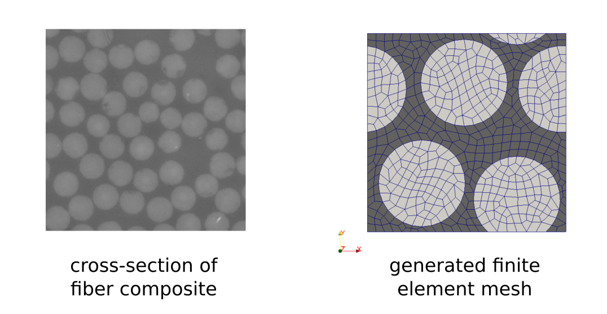
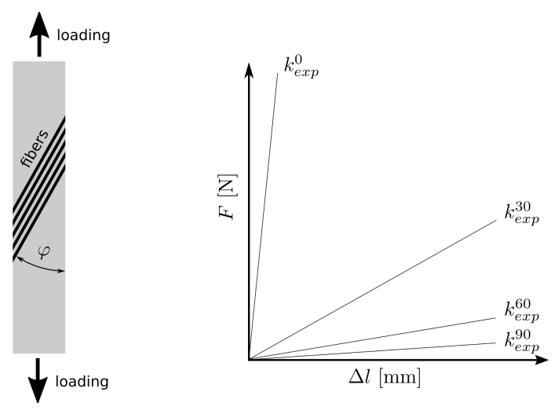
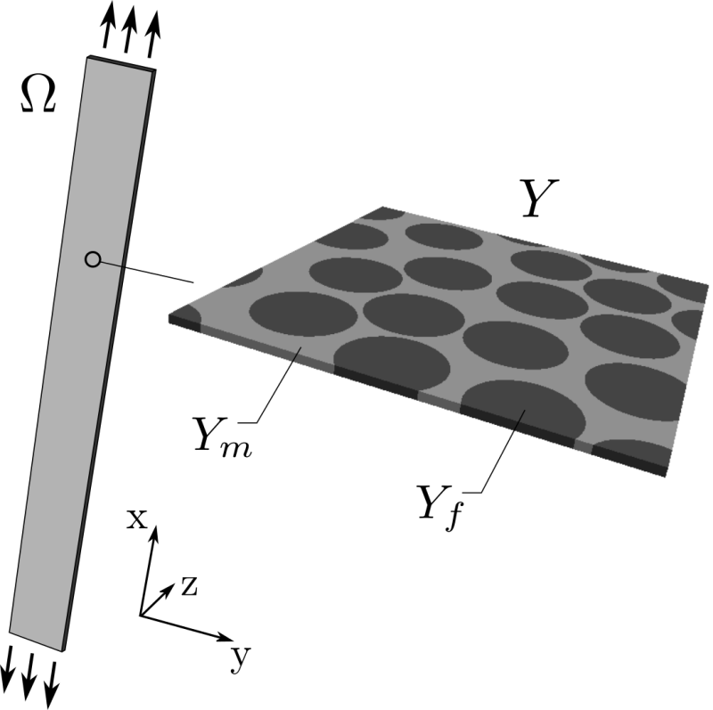
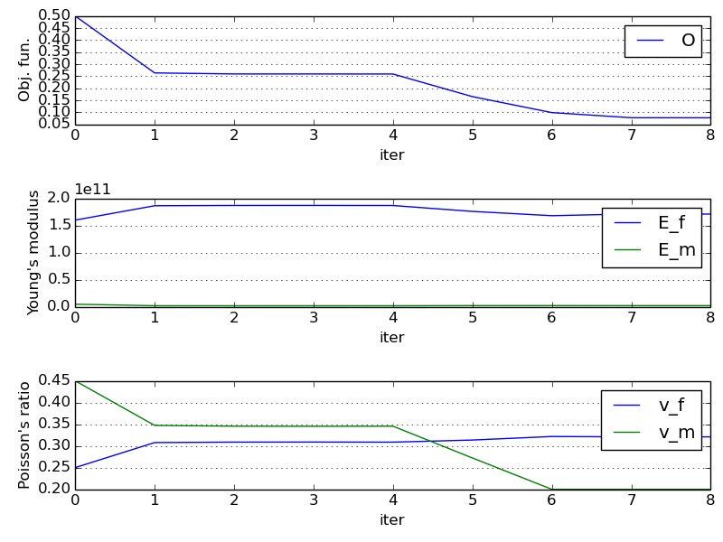

.. highlight:: python
   :linenothreshold: 3

.. include:: links.inc

.. _sec-mat_optim:

Material Identification
=======================

.. only:: html

   .. contents:: Table of Contents
      :local:
      :backlinks: top

Introduction
------------

This tutorial shows identification of material parameters of a composite
structure using data (force-displacement curves) obtained by a standard
tensile test.

Composite structure
^^^^^^^^^^^^^^^^^^^

The unidirectional long fiber carbon-epoxy composite is considered. Its
microstructure was analysed by the scanning electron microscopy and the data,
volume fractions and fibers cross-sections, were used to generate a periodic
finite element mesh (representative volume element - RVE) representing the
random composite structure at the microscopic level (the random structure
generation algorithm is described in [1]_):

This RVE is used in the micromechanical FE analysis which is based on the
two-scale homogenization method.

Material testing
^^^^^^^^^^^^^^^^

Several carbon-expoxy specimens with different fiber orientations (0, 30, 60 and
90 degrees) were subjected to the tensile test in order to obtain
force-elongation dependencies, see [2]_. The slopes of the linearized
dependencies were used in an objective function of the identification process.

Numerical simulation
---------------------

The linear isotropic material model is used for both components (fiber and
matrix) of the composite so only four material parameters (Young's modulus and
Poisson's ratio for each component) are necessary to fully describe the
mechanical behavior of the structure.

The numerical simulations of the tensile tests are based on the homogenization
method applied to the linear elastic problem [3]_. The homogenization procedure
results in the microscopic problem solved within the RVE and the macroscopic
problem that involves the homogenized elastic coefficients.

Homogenized coefficients
^^^^^^^^^^^^^^^^^^^^^^^^

The problem at the microscopic level is formulated in terms of characteristic
response functions and its solution is used to evaluate the homogenized
elasticity tensor. The microscopic problem has to be solved with the periodic
boundary conditions.

The following *SfePy* description file is used for definition of the microscopic
problem: :ref:`homogenization_opt_src`.

In the case of the identification process function `get_mat()` obtains the
material parameters (Young's modules, Poisson's ratios) from the outer
identification loop. Otherwise these parameters are given by values.

Notice the use of ``parametric_hook`` (:ref:`miscellaneous_options`) to pass
around the optimization parameters.

Macroscopic simulation
^^^^^^^^^^^^^^^^^^^^^^

The homogenized elasticity problem is solved for the unknown macroscopic
displacements and the elongation of the composite specimen is evaluated for a
given loading. These values are used to determine the slopes of the calculated
force-elongation dependencies which are required by the objective function.

The *SfePy* description file for the macroscopic analysis:
:ref:`linear_elasticity_opt_src`.

Identification procedure
------------------------

The identification of material parameters, i.e. the Young's modulus and
Poisson's ratio, of the epoxy matrix (:math:`E_m`, :math:`\nu_m`) and carbon
fibers (:math:`E_f`, :math:`\nu_f`) can be formulated as a minimization of the
following objective function:

.. math::
   :label: objective_function

   \Phi(\mathbf x) = \sum_{i \in \lbrace 0, 30, 60, 90\rbrace}
   \left(1 - {k_{comp}^i(\mathbf x) \over k_{exp}^i}\right)^2,

where :math:`k_{comp}^i` and :math:`k_{exp}^i` are the computed and measured
slopes of the force-elongation tangent lines for a given fiber orientation. This
function is minimized using `scipy.optimize.fmin_tnc()`, considering bounds of
the identified parameters.

Tho following steps are performed in each iteration of the optimization loop:

#. Solution of the microscopic problem, evaluation of the homogenized elasticity
   tensor.
#. Solution of the macroscopic problems for different fiber orientations
   (0, 30, 60, 90), this is incorporated by appropriate rotation of the
   elasticity tensor.
#. Evaluation of the objective function.

Python script for material identification: :ref:`material_opt_src`.

Running identification script
-----------------------------

Run the script from the command shell as (from the top-level directory of
*SfePy*)::

  $ python examples/homogenization/material_opt.py

The iteration process is monitored using graphs where the values of the
objective function and material parameters are plotted.

The resulting values of :math:`E_f`, :math:`\nu_f`, :math:`E_m`, :math:`\nu_m`
can be found at the end of the script output:

  >>> material optimization FINISHED <<<
  material_opt_micro: terminated
  optimized parameters: [1.71129526e+11 3.20844131e-01 2.33507829e+09 2.00000000e-01]

So that:

  :math:`E_f` = 171.13 GPa

  :math:`\nu_f` = 3.21

  :math:`E_m` = 2.34 GPa

  :math:`\nu_m` = 0.20

**Note:** The results may vary across SciPy versions and related libraries.

.. [1] Lubachevsky B. D., How to Simulate Billiards and Similar Systems,
       Journal of Computational Physics, 94(2), 1991.
       `<http://arxiv.org/PS_cache/cond-mat/pdf/0503/0503627v2.pdf>`_
.. [2] Srbová H., Kroupa T., Zemčík R., Identification of the Material
       Parameters of a Unidirectional Fiber Composite Using a Micromodel,
       Materiali in Tehnologije, 46(5), 2012, 431-434.
.. [3] Pinho-da-Cruz L., Oliveira J. A. and Teixeira-Dias F., Asymptotic
       homogenization in linear elasticity. Part I: Mathematical formulation
       and finite element modeling, Computational Materials Science, 45(4),
       2009, 1073–1080.
