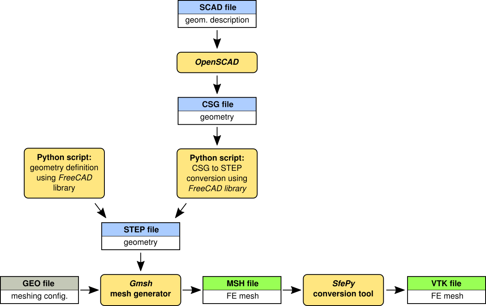
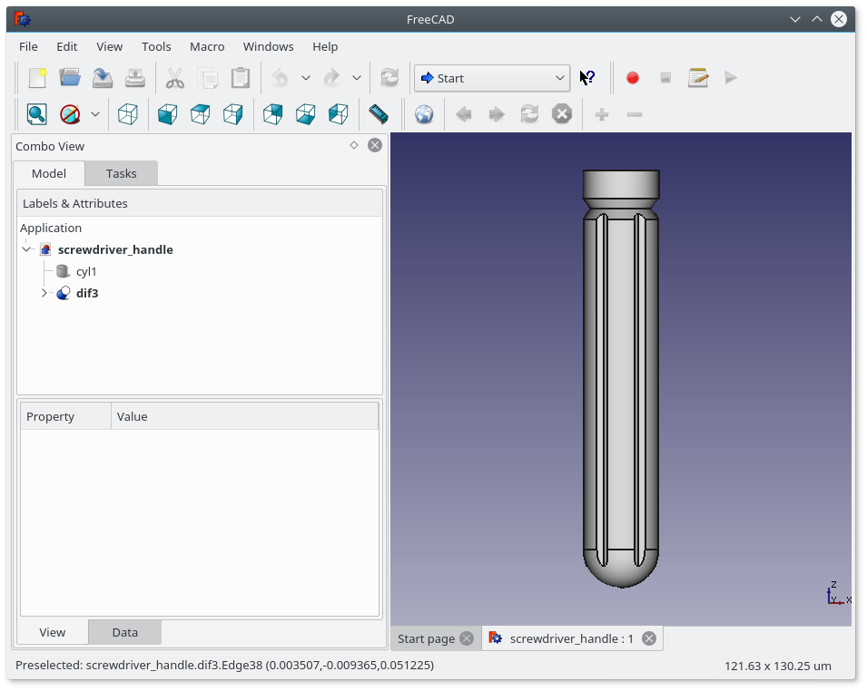
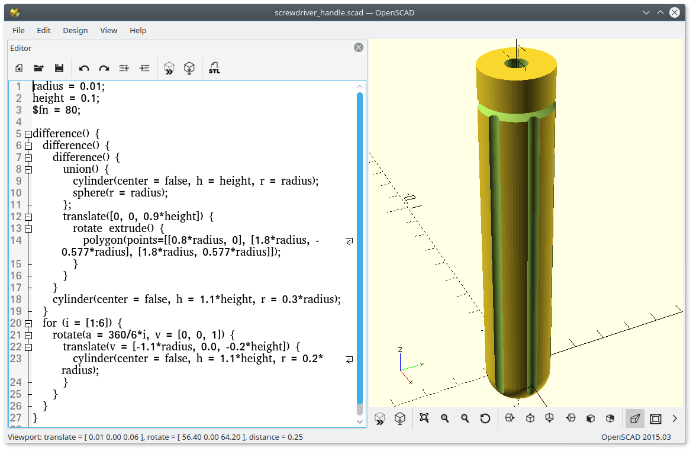
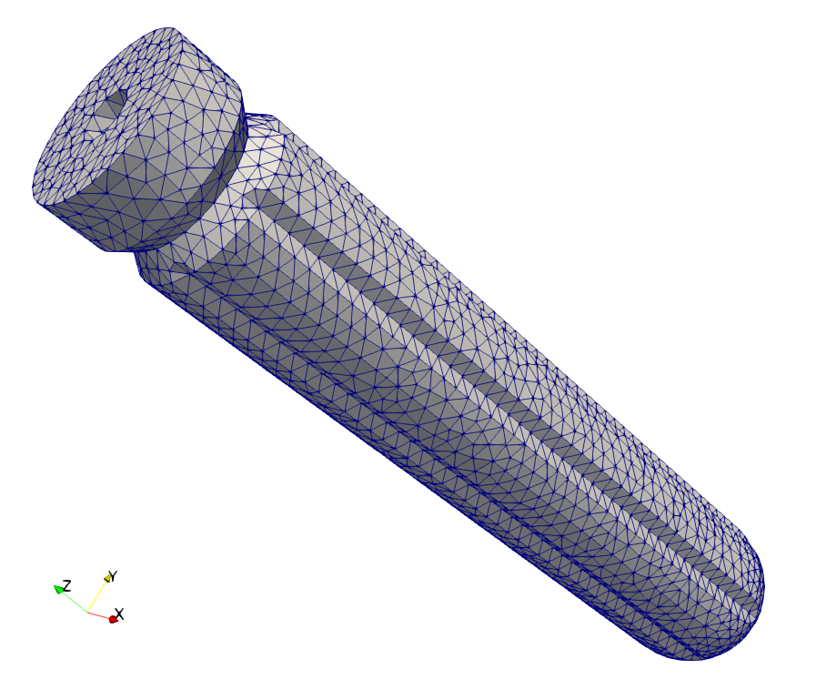
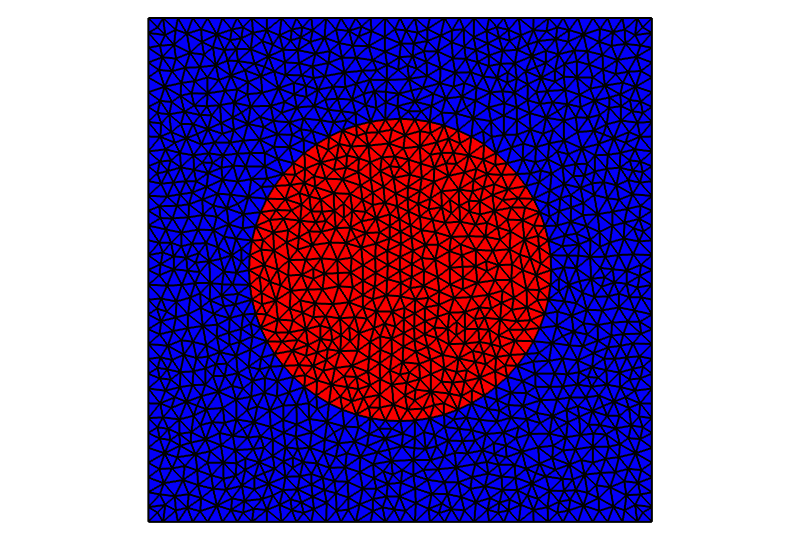
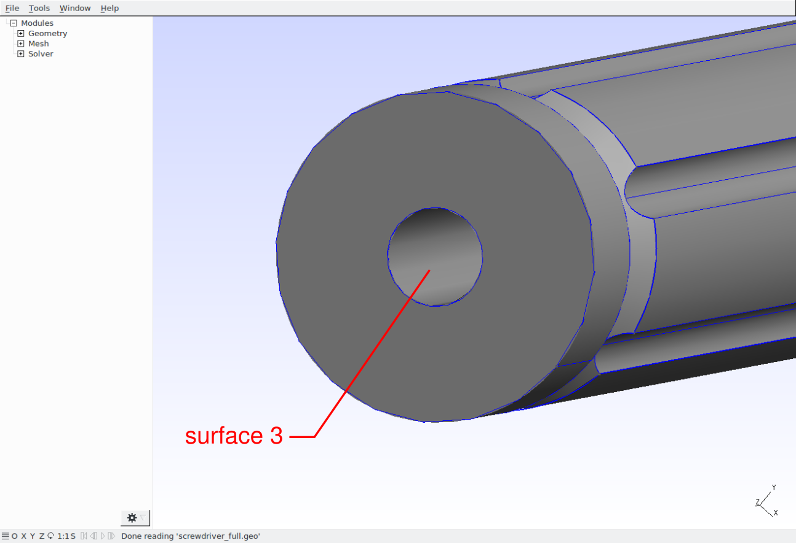
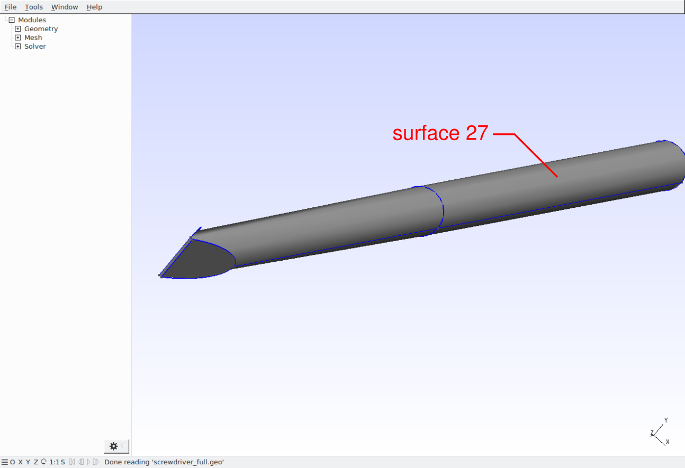
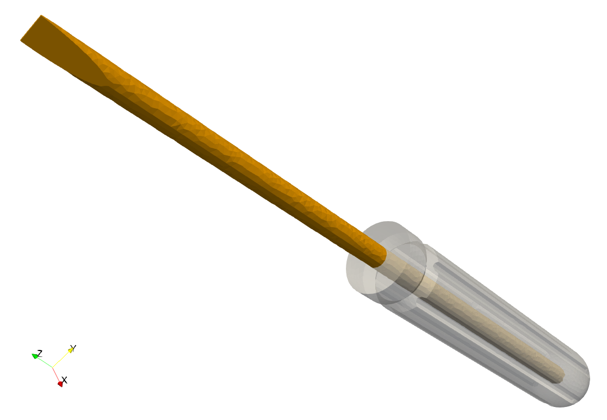

.. highlight:: python
   :linenothreshold: 3

.. include:: links.inc

.. _sec-preprocessing:

Preprocessing: *FreeCAD*/*OpenSCAD* + *Gmsh*
============================================

.. only:: html

   .. contents:: Table of Contents
      :local:
      :backlinks: top

Introduction
------------

There are several open source tools for preparing 2D and 3D finite element
meshes like `Salome`_, `FreeCAD`_, `Gmsh`_, `Netgen`_, etc. Most of them are GUI
based geometrical modeling and meshing environments/tools but they also usually
allow using their libraries in user scripts. Some of the above mentioned tools
are handy for solid modeling, some of them are great for meshing. This tutorial
shows how to combine solid geometry modeling functions provided by *FreeCAD* or
`OpenSCAD`_ with meshing functions of *Gmsh*.

The collaboration of modeling, meshing and conversion tools and the workflow are
illustrated in the following scheme.

Creating geometry using *FreeCAD*
---------------------------------

Functionalities of *FreeCAD* are accessible to Python and can be used to define
geometrical models in simple Python scripts. There is a tutorial related
to `Python scripting in FreeCAD`_.

The first step in creating a Python script is to set up a path to the *FreeCAD*
libraries and import all required modules::

  import sys
  FREECADPATH = '/usr/lib/freecad/lib/'
  sys.path.append(FREECADPATH)

  from FreeCAD import Base, newDocument
  import Part
  import Draft
  import ProfileLib.RegularPolygon as Poly

Now, a new empty *FreeCAD* document can be defined as::

  doc = newDocument()

All new objects describing the geometry will be added to this document.

In the following lines a geometrical model of a screwdriver handle will be
created. Let's start by defining a sphere and a cylinder and join these objects
into the one called ``uni``::

  radius = 0.01
  height = 0.1

  cyl = doc.addObject("Part::Cylinder", "cyl")
  cyl.Radius = radius
  cyl.Height = height

  sph = doc.addObject("Part::Sphere", "sph")
  sph.Radius = radius

  uni = doc.addObject("Part::MultiFuse", "uni")
  uni.Shapes = [cyl, sph]

Create a polygon, revolve it around the *z*-axis to create a solid and use the
result as the cutting tool applied to ``uni`` object::

  ske = doc.addObject('Sketcher::SketchObject', 'Sketch')
  ske.Placement = Base.Placement(Base.Vector(0, 0, 0),
                                 Base.Rotation(-0.707107, 0, 0, -0.707107))
  Poly.makeRegularPolygon('Sketch', 5,
                          Base.Vector(-1.2 * radius, 0.9 * height, 0),
                          Base.Vector(-0.8 * radius, 0.9 * height, 0))

  cut = doc.addObject("PartDesign::Revolution", "Revolution")
  cut.Sketch = ske
  cut.ReferenceAxis = (ske, ['V_Axis'])
  cut.Angle = 360.0

  dif = doc.addObject("Part::Cut", "dif")
  dif.Base = uni
  dif.Tool = cut

Create a cylinder, make a polar array of the cylinder objects and subtract it
from the previous result::

  cyl1 = doc.addObject("Part::Cylinder", "cyl1")
  cyl1.Radius = 0.2 * radius
  cyl1.Height = 1.1 * height
  cyl1.Placement = Base.Placement(Base.Vector(-1.1 * radius, 0, -0.2 * height),
                                  Base.Rotation(0, 0, 0, 1))

  arr = Draft.makeArray(cyl1, Base.Vector(1, 0, 0), Base.Vector(0, 1, 0), 2, 2)
  arr.ArrayType = "polar"
  arr.NumberPolar = 6

  dif2 = doc.addObject("Part::Cut", "dif2")
  dif2.Base = dif
  dif2.Tool = arr

Create a middle hole for the screwdriver metal part::

  cyl2 = doc.addObject("Part::Cylinder", "cyl2")
  cyl2.Radius = 0.3 * radius
  cyl2.Height = height

  dif3 = doc.addObject("Part::Cut", "dif3")
  dif3.Base = dif2
  dif3.Tool = cyl2

Finally, recompute the geometry, export the part to the *STEP* file and save the
document in *FreeCAD* format (not really needed for subsequent mesh generation,
but may be useful for visualization and geometry check)::

  doc.recompute()

  Part.export([dif3], 'screwdriver_handle.step')

  doc.saveAs('screwdriver_handle.FCStd')

A finite element mesh can be generated directly in *FreeCAD* using ``MeshPart``
module::

  import MeshPart

  mesh = doc.addObject("Mesh::Feature", "Mesh")
  mesh.Mesh = MeshPart.meshFromShape(Shape=dif3.Shape, MaxLength=0.002)
  mesh.Mesh.write("./screwdriver_handle.bdf", "NAS", "mesh")

The meshing function of ``MeshPart`` module is limited to triangular grids so
it is better to use `Gmsh`_ mesh generator which can provide triangular and
quadrilateral meshes in 2D or tetrahedral and hexahedral meshes in 3D. *Gmsh*
allows to control the meshing process through a wide range of parameters.
Meshing by *Gmsh* will be described in section :ref:`preprocessing_gmsh`.

The example of screwdriver handle:
:download:`screwdriver_handle.py <preprocessing/screwdriver_handle.py>`.

There are two simple ways how to discover Python calls of *FreeCAD* functions.
You can enable "show script commands in python console" in
``Edit->Preferences->General->Macro`` and the Python console by selecting
``View->Views->Python Console`` and all subsequent operations will be printed in
the console as the Python code. The second way is to switch on the macro
recording function (``Macro->Macro recording ...``) which generates a Python
script (*FCMacro* file) containing all the code related to actions in the
*FreeCAD* graphical interface.

Creating geometry using *OpenSCAD*
----------------------------------

The alternative tool for solid geometrical modeling is *OpenSCAD* - "The
Programmers Solid 3D CAD Modeller". It has its own description language based on
functional programming that is used to construct solid models using geometrical
primitives similar to *FreeCAD*. Solid geometries can be exported to several
file formats including *STL* and *CSG*. *OpenSCAD* allows solid modeling based
on Constructive Solid Geometry (CSG) principles and extrusion of 2D objects into
3D. The model of a screwdriver handle presented in the previous section can be
defined in *OpenSCAD* by the following code
(:download:`screwdriver_handle.scad <preprocessing/screwdriver_handle.scad>`)::

  radius = 0.01;
  height = 0.1;
  $fn = 50;

  difference() {
    difference() {
      difference() {
        union() {
          cylinder(center=false, h=height, r=radius);
          sphere(radius);
        };
        translate([0, 0, 0.9*height])
          rotate_extrude()
            polygon([[0.8*radius, 0], [1.8*radius, -0.577*radius], [1.8*radius, 0.577*radius]]);
      }
      cylinder(center=false, h=1.1*height, r=0.3*radius);
    }
    for (i = [1:6]) {
      rotate([0, 0, 360/6*i])
        translate([-1.1*radius, 0.0, -0.2*height])
          cylinder(center=false, h=1.1*height, r=0.2*radius);
    }
  }

To generate a finite element mesh of the solid geometry the model must be
exported to a suitable file format. *OpenSCAD* has limited export options, but
by using *FreeCAD* import/export functions, it is possible to find a workaround.
The *OpenSCAD* model can be exported to the *CSG* file format and *FreeCAD* can
be used as a mesh converter to the *STEP* format::

  import sys
  sys.path.append('/usr/lib/freecad/lib/')
  sys.path.append('/usr/lib/freecad/Mod/OpenSCAD/')

  import FreeCAD
  import Part
  import importCSG

  importCSG.open('screwdriver_handle.csg')
  Part.export([FreeCAD.ActiveDocument.Objects[-1]], 'screwdriver_handle.step')

.. _preprocessing_gmsh:

Gmsh - generating finite element mesh
-------------------------------------

*Gmsh* can create finite element meshes using geometrical models imported from
*STEP*, *IGES* and *BRep* files (has to be compiled with *OpenCASCADE* support).

The following *GEO* file imports ``screwdriver_handle.step`` file and defines
a field controlling the mesh size
(:download:`screwdriver_handle.geo <preprocessing/screwdriver_handle.geo>`)::

  Merge "screwdriver_handle.step";

  Field[1] = MathEval;
  Field[1].F = "0.002";
  Background Field = 1;

Now, run *Gmsh* generator and export the mesh into the *MSH* format in which all
surface and volumetric elements are stored::

  gmsh -3 -format msh -o screwdriver_handle.msh screwdriver_handle.geo

By converting the *MSH* file into the *VTK* format using
``script/convert_mesh.py``::

  script/convert_mesh.py screwdriver_handle.msh screwdriver_handle.vtk

the surface elements are discarded and only the volumetric mesh is preserved.

Note: planar 2D meshes
^^^^^^^^^^^^^^^^^^^^^^

To create a planar 2D mesh, such as

that can be described by :download:`this <preprocessing/circle_in_square.geo>`
*Gmsh* code, the mesh generator can be called as follows::

  gmsh -2 -format msh -o circle_in_square.msh circle_in_square.geo

This, however is not enough to create a truly 2D mesh - the created mesh
vertices still have the third, :math:`z`, component which is equal to zero. In
order to remove the third component, use::

  script/convert_mesh.py --2d circle_in_square.msh circle_in_square.h5

Now, in the resulting ``circle_in_square.h5``, each vertex has only two
coordinates. Another way of generating the 2D mesh is to use the legacy VTK
format as follows::

  gmsh -2 -format vtk -o circle_in_square.vtk circle_in_square.geo
  script/convert_mesh.py circle_in_square.vtk circle_in_square.h5

This is due to the fact that the legacy VTK does not support 2D vertices and so
the :class:`VTKMeshIO <sfepy.discrete.fem.meshio.VTKMeshIO>` reader tries to
detect the planar geometry by comparing the :math:`z` components to zero - the
``--2d`` option of ``script/convert_mesh.py`` is not needed in this case.

Multipart models
----------------

Meshing models composed of parts with different material groups is a little bit
tricky task. But there are some more or less general ways of doing that. Here,
the method using functions of *Gmsh* for periodic meshes will be shown.

The screwdriver handle example is extended by adding a screwdriver shank.
The new part is composed of a cylinder trimmed at one end::

  cyl3 = doc.addObject("Part::Cylinder", "cyl3")
  cyl3.Radius = 0.3 * radius
  cyl3.Height = height
  cyl3.Placement = Base.Placement(Base.Vector(0, 0, height),
                                  Base.Rotation(0, 0, 0, 1))

  tip1 = doc.addObject("Part::Box", "tip1")
  tip1.Length = radius
  tip1.Width = 2 * radius
  tip1.Height = 3 * radius
  tip1.Placement = Base.Placement(Base.Vector(0, -radius, 1.71 * height),
                                  Base.Rotation(Base.Vector(0, 1, 0), -10),
                                  Base.Vector(0, 0, 3 * radius))

  tip2 = doc.addObject("Part::Mirroring", "tip2")
  tip2.Source = tip1
  tip2.Normal = (1, 0, 0)

  tip3 = doc.addObject("Part::MultiFuse", "tip3")
  tip3.Shapes = [tip1, tip2]

  dif4 = doc.addObject("Part::Cut", "dif4")
  dif4.Base = cyl3
  dif4.Tool = tip3

  uni2 = doc.addObject("Part::MultiFuse", "uni2")
  uni2.Shapes = [cyl2, dif4]

The handle and shank are exported to the *STEP* file as two separated parts::

  doc.recompute()

  Part.export([dif3, uni2], 'screwdriver_full.step')
  doc.saveAs('screwdriver_full.FCStd')

The full screwdriver example (handle + shank):
:download:`screwdriver_full.py <preprocessing/screwdriver_full.py>`.

To create a coincidence mesh on the handle and shank interface, it is necessary
to identify the interface surfaces and declare them to be periodic in the *GEO*
file. The identification has to be done manually in the *Gmsh* graphical
interface.

The input file for *Gmsh* is than as follows
(:download:`screwdriver_full.geo <preprocessing/screwdriver_full.geo>`)::

  Merge "screwdriver_full.step";

  Periodic Surface 5 {7} = 26 {67};
  Periodic Surface 3 {6, 2, -6, 7} = 27 {68, 69, -68, 67};

  Physical Volume(1) = {1};
  Physical Volume(2) = {2};

  Field[1] = MathEval;
  Field[1].F = "0.0015";
  Background Field = 1;

where the first pair of periodic surfaces corresponds to the common circle faces
(bottom of the shank) and the second pair to the common cylindrical surfaces.
See `Gmsh Reference manual`_ for details on periodic meshing.

Using the above stated *GEO* file, *Gmsh* creates a mesh containing duplicate
vertices on the handle/shank interface. These duplicate vertices can be removed
during the conversion to the *VTK* format by giving ``--merge`` (or just ``-m``)
argument to `convert_mesh.py` script::

  script/convert_mesh.py -m screwdriver_full.msh screwdriver_full.vtk

In order to extract the cells by the physical groups use the conversion script
with ``--save-per-mat`` argument::

  script/convert_mesh.py --save-per-mat screwdriver_full.vtk screwdriver.vtk

It produces `screwdriver.vtk` contaning the original mesh and
`screwdriver_matid_1.vtk`, `screwdriver_matid_2.vtk` files containing only
the cells of a given physical group and all vertices of the original mesh.

When using *OpenSCAD*, define the full screwdriver geometry as
(:download:`screwdriver_full.scad <preprocessing/screwdriver_full.scad>`)::

  radius = 0.01;
  height = 0.1;
  $fn = 50;

  module tip() {
    rotate([0, -10, 0])
      translate([0, -radius, -3*radius])
        cube([radius, 2*radius, 3*radius], center=false);
  }

  difference() {
    difference() {
      difference() {
        union() {
          cylinder(center=false, h=height, r=radius);
          sphere(radius);
        };
        translate([0, 0, 0.9*height])
          rotate_extrude()
            polygon([[0.8*radius, 0], [1.8*radius, -0.577*radius], [1.8*radius, 0.577*radius]]);
      }
      cylinder(center=false, h=height, r=0.3*radius);
    }
    for (i = [1:6]) {
      rotate([0, 0, 360/6*i])
        translate([-1.1*radius, 0.0, -0.2*height])
          cylinder(center=false, h=1.1*height, r=0.2*radius);
    }
  }

  union() {
    difference() {
      translate([0, 0, height])
        cylinder(center=false, h=height, r=0.3*radius);
      translate([0, 0, 1.71*height + 3*radius])
        union() {
          tip();
          mirror ([1, 0, 0]) tip();
        }
    }
    cylinder(center=false, h=height, r=0.3*radius);
  }

and convert the *CSG* file to the *STEP* file by::

  importCSG.open('screwdriver_full.csg')
  top_group = FreeCAD.ActiveDocument.Objects[-1]
  Part.export(top_group.OutList, 'screwdriver_full.step')

Since the different tools for geometry definition have been used, the numbering
of geometric objects may differ and the surface and edge numbers have to be
changed in the *GEO* file::

  Periodic Surface 5 {6} = 26 {66};
  Periodic Surface 3 {5, 2, -5, 6} = 27 {67, 68, -67, 66};

Note: The numbering of objects may vary between *FreeCAD*, *OpenSCAD* and *Gmsh*
versions.
