.. include:: links.inc

.. _sec-primer:

Primer
======

.. only:: html

   .. contents:: Table of Contents
      :local:
      :backlinks: top

A beginner's tutorial highlighting the basics of *SfePy*.

Introduction
------------

This primer presents a step-by-step walk-through of the process to solve
a simple mechanics problem. The typical process to solve a problem using
*SfePy* is followed: a model is meshed, a problem definition file is
drafted, *SfePy* is run to solve the problem and finally the results of
the analysis are visualised.

Problem statement
^^^^^^^^^^^^^^^^^

A popular test to measure the tensile strength of concrete or asphalt
materials is the indirect tensile strength (ITS) test pictured below. In
this test a cylindrical specimen is loaded across its diameter to
failure. The test is usually run by loading the specimen at a constant
deformation rate of 50 mm/minute (say) and measuring the load
response. When the tensile stress that develops in the specimen under
loading exceeds its tensile strength then the specimen will fail. To
model this problem using finite elements the indirect tensile test can
be simplified to represent a diametrically point loaded disk as shown in
the schematic.

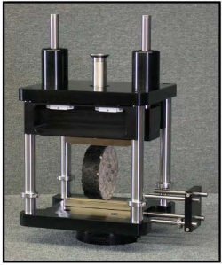
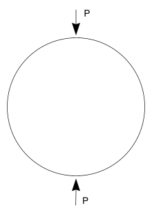

The tensile and compressive stresses that develop in the specimen as a
result of the point loads P are a function of the diameter :math:`D` and
thickness :math:`t` of the cylindrical specimen. At the centre of the
specimen, the compressive stress is 3 times the tensile stress and the
analytical formulation for these are, respectively:

.. math::
   :label: eq_tensile_stress

   \sigma_t=\frac{2P}{\pi tD}

.. math::
   :label: eq_compressive_stress

   \sigma_c=\frac{6P}{\pi tD}

These solutions may be approximated using finite element methods. To
solve this problem using *SfePy* the first step is meshing a suitable
model.

Meshing
-------

Assuming plane strain conditions, the indirect tensile test may be modelled
using a 2D finite element mesh. Furthermore, the geometry of the model is
symmetrical about the x- and y-axes passing through the centre of the
circle. To take advantage of this symmetry only one quarter of the 2D model
will be meshed and boundary conditions will be established to indicate this
symmetry. The meshing program `Gmsh`_ is used here to very quickly mesh the
model. Follow these steps to model the ITS:

#. The ITS specimen has a diameter of 150 mm. Using *Gmsh* add three new
   points (geometry elementary entities) at the following coordinates:
   :math:`(0.0 0.0), (75.0,0.0) \,\textrm{and}\, (0.0,75.0)`.
#. Next add two straight lines connecting the points.
#. Next add a Circle arc connecting two of the points to form the
   quarter circle segment.
#. Still under `Geometry` add a ruled surface.
#. With the geometry of the model defined, add a mesh by clicking on the
   2D button under the Mesh functions.

The figures that follow show the various stages in the model process.

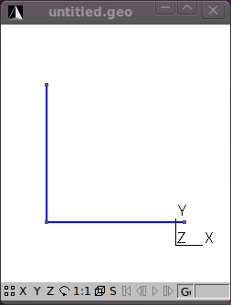
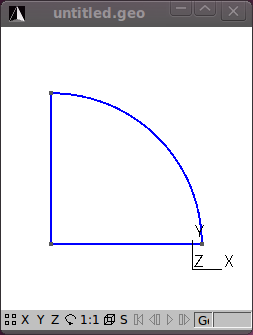
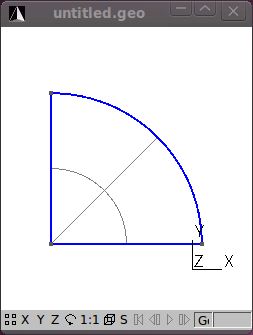
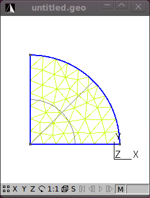

That's the meshing done. Save the mesh in a format that *SfePy*
recognizes. For now use the `medit` `.mesh` format e.g. `its2D.mesh`.

**Hint:** Check the drop down in the *Save As* dialog for the different
formats that *Gmsh* can save to.

If you open the `its2D.mesh` file using a text editor you'll notice that
*Gmsh* saves the mesh in a 3D format and includes some extra geometry
items that should be deleted. Reformatted the mesh file to a 2D format
and delete the *Edges* block. Note that when you do this the file cannot
be reopened by *Gmsh* so it is always a good idea to also save your
meshes in *Gmsh's* native format as well (Shift-Ctrl-S). Click
:download:`here <../meshes/2d/its2D.mesh>` to download the reformatted
mesh file that will be used in the tutorial.

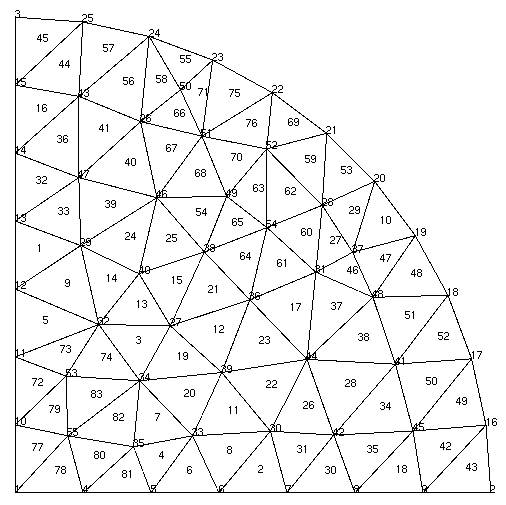

You'll notice that the mesh contains 55 vertices (nodes) and 83 triangle
elements. The mesh file provides the coordinates of the nodes and the
element connectivity. It is important to note that node and element
numbering in *SfePy* start at 0 and not 1 as is the case in *Gmsh* and
some other meshing programs.

To view `.mesh` files you can use a demo of `medit`_. After loading your
mesh file with medit you can see the node and element numbering by
pressing **P** and **F** respectively. The numbering in medit starts at
1 as shown. Thus the node at the center of the model in *SfePy*
numbering is 0, and elements 76 and 77 are connected to this node. Node
and element numbers can also be viewed in *Gmsh* -- under the `mesh` option
under the `Visibility` tab enable the `node` and `surface` labels. Note that
the surface labels as numbered in *Gmsh* follow on from the line
numbering. So to get the corresponding element number in *SfePy* you'll
need to subtract the number of lines in the *Gmsh* file + 1. Confused
yet? Luckily, *SfePy* provides some useful mesh functions to indicate
which elements are connected to which nodes. Nodes and elements can also
be identified by defining regions, which is addressed later.

Another open source python option to view `.mesh` files is the
appropriately named `Python Mesh Viewer`_.

The next step in the process is coding the *SfePy* problem definition file.

.. _primer_example_file:

Problem description
-------------------

The programming of the `problem description file` is well documented in
the *SfePy* :doc:`users_guide`. The problem description file used in the
tutorial follows:

.. literalinclude:: /../examples/linear_elasticity/its2D_1.py

Download the :download:`Problem description file
</../examples/linear_elasticity/its2D_1.py>` and open it in your favourite
Python editor. Note that you may wish to change the location of the output
directory to somewhere on your drive. You may also need to edit the mesh file
name. For the analysis we will assume that the material of the test specimen is
linear elastic and isotropic. We define two material constants i.e. Young's
modulus and Poisson's ratio. The material is assumed to be asphalt concrete
having a Young's modulus of 2,000 MPa and a Poisson's ration of 0.4.

**Note:** Be consistent in your choice and use of units. In the tutorial
we are using Newton (N), millimeters (mm) and megaPascal (MPa). The
:doc:`sfepy.mechanics.units <src/sfepy/mechanics/units>` module might
help you in determining which derived units correspond to given basic
units.

The following block of code defines regions on your mesh::

    regions = {
        'Omega' : 'all',
        'Left' : ('vertices in (x < 0.001)', 'facet'),
        'Bottom' : ('vertices in (y < 0.001)', 'facet'),
        'Top' : ('vertex 2', 'vertex'),
    }

Four regions are defined:

    1. `'Omega'`: all the elements in the mesh,
    2. `'Left'`: the y-axis,
    3. `'Bottom'`: the x-axis,
    4. `'Top'`: the topmost node. This is where the load is applied.

Having defined the regions these can be used in other parts of your
code. For example, in the definition of the boundary conditions::

    ebcs = {
        'XSym' : ('Bottom', {'u.1' : 0.0}),
        'YSym' : ('Left', {'u.0' : 0.0}),
    }

Now the power of the regions entity becomes apparent. To ensure symmetry
about the x-axis, the vertical or y-displacement of the nodes in the
`'Bottom'` region are prevented or set to zero. Similarly, for symmetry
about the y-axis, any horizontal or displacement in the x-direction of
the nodes in the `'Left'` region or y-axis is prevented.

The load is specified in terms of the `'Load'` material as
follows::

    materials = {
        'Asphalt' : ({
            'lam' : lame_from_youngpoisson(young, poisson)[0],
            'mu' : lame_from_youngpoisson(young, poisson)[1],
        },),
        'Load' : ({'.val' : [0.0, -1000.0]},),
    }

Note the dot in `'.val'` -- this denotes a special material value, i.e.,
a value that is not to be evaluated in quadrature points. The load is
then applied in equations using the `'dw_point_load.0.Top(Load.val, v)'`
term in the topmost node (region `'Top'`).

We provided the material constants in terms of Young's modulus and
Poisson's ratio, but the linear elastic isotropic equation used requires
as input Lamé's parameters. The `lame_from_youngpoisson()` function is thus
used for conversion. Note that to use this function it was necessary to
import the function into the code, which was done up front:

::

    from sfepy.mechanics.matcoefs import lame_from_youngpoisson

**Hint:** Check out the :doc:`sfepy.mechanics.matcoefs
<src/sfepy/mechanics/matcoefs>` module for other useful material related
functions.

That's it -- we are now ready to solve the problem.

Running *SfePy*
---------------

One option to solve the problem is to run the *SfePy* `simple.py` script
from the command line::

    ./simple.py its2D_1.py

**Note:** For the purpose of this tutorial it is assumed that the
`problem description file` (``its2D_1.py``) is in the same directory as
the *simple.py* script. If you have the ``its2D_1.py`` file in another directory
then make sure you include the path to this file as well.

*SfePy* solves the problem and outputs the solution to the output path
(`output_dir`) provided in the script. The output file will be in the VTK
format by default if this is not explicitly specified and the name of
the output file will be the same as that used for the mesh file except
with the `'.vtk'` extension i.e. ``its2D.vtk``.

The VTK format is an ASCII format. Open the file using a text
editor. You'll notice that the output file includes separate sections:

    * POINTS (these are the model nodes),
    * CELLS (the model element connectivity),
    * VECTORS (the node displacements in the x-, y- and z- directions).

*SfePy* provides a script (`postproc.py`) to quickly view the solution. To run
this script you need to have `Mayavi`_ installed. From the command line issue
the following (assuming the correct paths)::

    ./postproc.py its2D.vtk

The `postproc.py` script generates the image shown below, which shows by
default the displacements in the model as arrows and their magnitude as
color scale. Cool, but we are more interested in the stresses. To get
these we need to modify the problem description file and do some
post-processing.

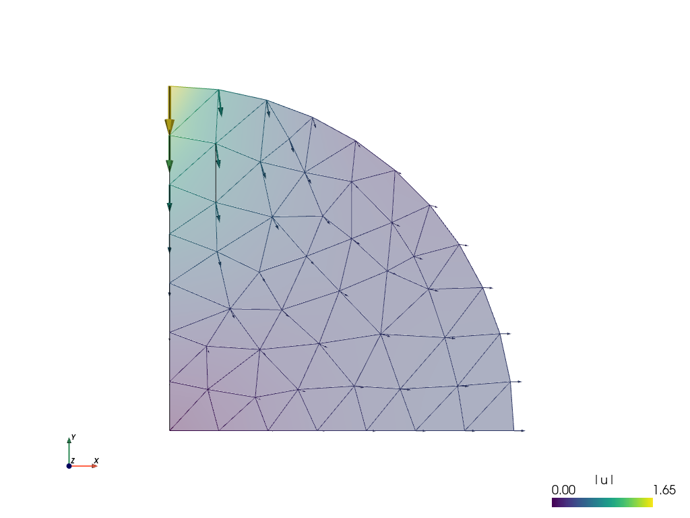

Post-processing
---------------

*SfePy* provides functions to calculate stresses and strains. We'll
include a function to calculate these and update the problem material
definition and options to call this function as a
`post_process_hook()`. Save this file as :download:`its2D_2.py
</../examples/linear_elasticity/its2D_2.py>`.

.. literalinclude:: /../examples/linear_elasticity/its2D_2.py

The updated file imports all of the previous definitions in
``its2D_1.py``. The stress function (`de_cauchy_stress()`) requires as input
the stiffness tensor -- thus it was necessary to update the materials
accordingly. The problem options were also updated to call the
`stress_strain()` function as a `post_process_hook()`.

Run *SfePy* to solve the updated problem and view the solution (assuming
the correct paths)::

    ./simple.py its2D_2.py
    ./postproc.py its2D.vtk -b

In addition to the node displacements, the VTK output shown below now
also includes the stresses and strains averaged in the elements:

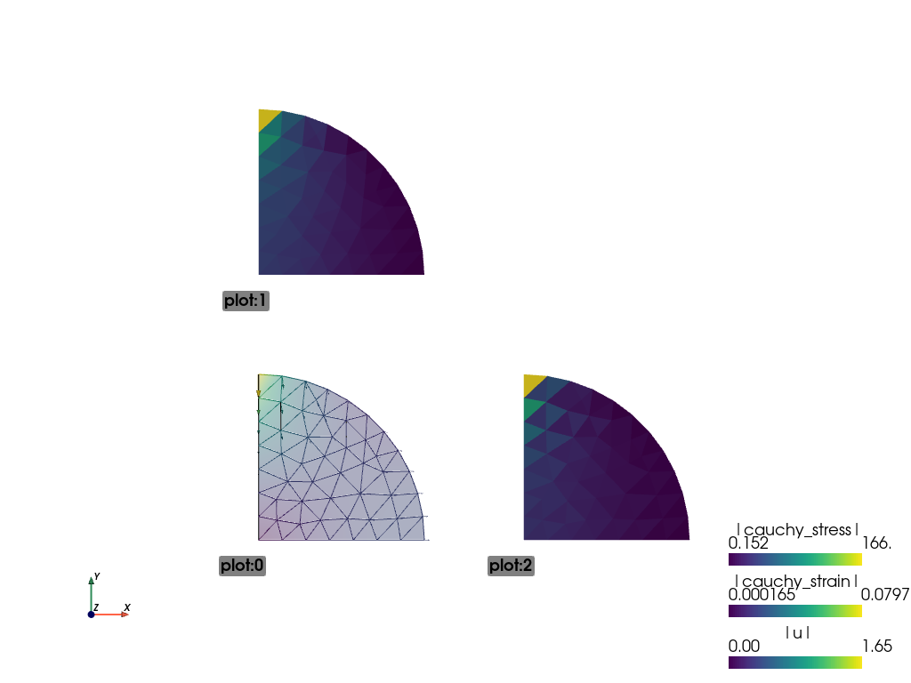

Remember the objective was to determine the stresses at the centre of
the specimen under a load :math:`P`. The solution as currently derived is
expressed in terms of a global displacement vector :math:`u`. The global
(residual) force vector :math:`f` is a function of the global displacement
vector and the global stiffness matrix  :math:`K` as: :math:`f = Ku`.
Let's determine the force vector interactively.

Running SfePy in interactive mode
^^^^^^^^^^^^^^^^^^^^^^^^^^^^^^^^^

In addition to solving problems using the `simple.py` script you can also run
*SfePy* interactively (we will use `IPython`_ interactive shell in following
examples).

In the *SfePy* top-level directory run ::

    ipython

issue the following commands:

.. sourcecode:: ipython

    In [1]: from sfepy.applications import solve_pde

    In [2]: pb, state = solve_pde('its2D_2.py')

The problem is solved and the problem definition and solution are
provided in the `pb` and `state` variables respectively. The solution,
or in this case, the global displacement vector :math:`u`, contains the x- and
y-displacements at the nodes in the 2D model:

.. sourcecode:: ipython

    In [3]: u = state()

    In [4]: u
    Out[4]:
    array([ 0.        ,  0.        ,  0.37376671, ..., -0.19923848,
            0.08820237, -0.11201528])

    In [5]: u.shape
    Out[5]: (110,)

    In [6]: u.shape = (55, 2)

    In [7]: u
    Out[7]:
    array([[ 0.        ,  0.        ],
           [ 0.37376671,  0.        ],
           [ 0.        , -1.65318152],
           ...,
           [ 0.08716448, -0.23069047],
           [ 0.27741356, -0.19923848],
           [ 0.08820237, -0.11201528]])

**Note:** We have used the fact, that the state vector contains only one
variable (`u`). In general, the following can be used:

.. sourcecode:: ipython

    In [8]: u = state.get_parts()['u']

    In [9]: u
    Out[9]:
    array([[ 0.        ,  0.        ],
           [ 0.37376671,  0.        ],
           [ 0.        , -1.65318152],
           ...,
           [ 0.08716448, -0.23069047],
           [ 0.27741356, -0.19923848],
           [ 0.08820237, -0.11201528]])

Both `state()` and `state.get_parts()` return a view of the DOF vector,
that is why in Out[8] the vector is reshaped according to Out[6].

From the above it can be seen that *u* holds the displacements at the 55
nodes in the model and that the displacement at node 2 (on which the
load is applied) is :math:`(0, -1.65318152)`. The global stiffness
matrix is saved in `pb` as a `sparse matrix`_:

.. sourcecode:: ipython

    In [10]: K = pb.mtx_a

    In [11]: K
    Out[11]:
    <94x94 sparse matrix of type '<type 'numpy.float64'>'
            with 1070 stored elements in Compressed Sparse Row format>

    In [12]: print K
      (0, 0)        2443.95959851
      (0, 7)        -2110.99917491
      (0, 14)       -332.960423597
      (0, 15)       1428.57142857
      (1, 1)        2443.95959852
      (1, 13)       -2110.99917492
      (1, 32)       1428.57142857
      (1, 33)       -332.960423596
      (2, 2)        4048.78343529
      (2, 3)        -1354.87004384
      (2, 52)       -609.367453538
      (2, 53)       -1869.0018791
      (2, 92)       -357.41672785
      (2, 93)       1510.24654193
      (3, 2)        -1354.87004384
      (3, 3)        4121.03202907
      (3, 4)        -1696.54911732
      (3, 48)       76.2400806561
      (3, 49)       -1669.59247304
      (3, 52)       -1145.85294856
      (3, 53)       2062.13955556
      (4, 3)        -1696.54911732
      (4, 4)        4410.17902905
      (4, 5)        -1872.87344838
      (4, 42)       -130.515009576
      :     :
      (91, 81)      -1610.0550578
      (91, 86)      -199.343680224
      (91, 87)      -2330.41406097
      (91, 90)      -575.80373408
      (91, 91)      7853.23899229
      (92, 2)       -357.41672785
      (92, 8)       1735.59411191
      (92, 50)      -464.976034459
      (92, 51)      -1761.31189004
      (92, 52)      -3300.45367361
      (92, 53)      1574.59387937
      (92, 88)      -250.325600254
      (92, 89)      1334.11823335
      (92, 92)      9219.18643706
      (92, 93)      -2607.52659081
      (93, 2)       1510.24654193
      (93, 8)       -657.361661955
      (93, 50)      -1761.31189004
      (93, 51)      54.1134516246
      (93, 52)      1574.59387937
      (93, 53)      -315.793227627
      (93, 88)      1334.11823335
      (93, 89)      -4348.13351285
      (93, 92)      -2607.52659081
      (93, 93)      9821.16012014

    In [13]: K.shape
    Out[13]: (94, 94)

One would expect the shape of the global stiffness matrix :math:`K` to be
:math:`(110,110)` i.e. to have the same number of rows and columns as `u`. This
matrix has been reduced by the fixed degrees of freedom imposed by the
boundary conditions set at the nodes on symmetry axes. To restore the
matrix, temporarily remove the imposed boundary conditions:

.. sourcecode:: ipython

    In [14]: pb.remove_bcs()

Now we can calculate the force vector :math:`f`:

.. sourcecode:: ipython

    In [15]: f = pb.evaluator.eval_residual(u)

    In [16]: f.shape
    Out[16]: (110,)

    In [17]: f
    Out[17]:
    array([ -4.73618436e+01,   1.42752386e+02,   1.56921124e-13, ...,
            -2.06057393e-13,   2.13162821e-14,  -2.84217094e-14])

Remember to restore the original boundary conditions previously removed
in step [14]:

.. sourcecode:: ipython

    In [18]: pb.time_update()

To view the residual force vector, we can save it to a VTK file. This
requires creating a state and set its DOF vector to `f` as follows:

.. sourcecode:: ipython

    In [19]: state = pb.create_state()
    In [20]: state.set_full(f)
    In [21]: out = state.create_output_dict()
    In [22]: pb.save_state('file.vtk', out=out)

Running the `postproc.py` script on ``file.vtk`` displays the average nodal
forces as shown below:

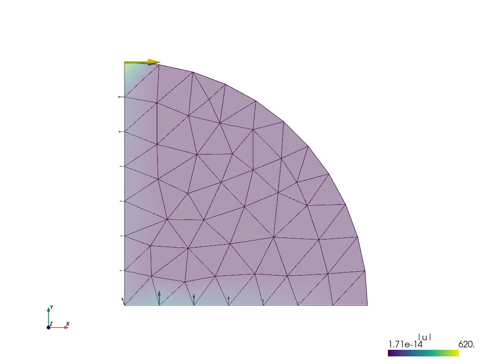

The forces in the x- and y-directions at node 2 are:

.. sourcecode:: ipython

    In [23]: f.shape = (55, 2)
    In [24]: array([  6.20373272e+02,  -1.13686838e-13])

Great, we have an almost zero residual vertical load or force apparent
at node 2 i.e. -1.13686838e-13 Newton. Let us now check the stress at
node 0, the centre of the specimen.

Generating output at element nodes
^^^^^^^^^^^^^^^^^^^^^^^^^^^^^^^^^^

Previously we had calculated the stresses in the model but these were
averaged from those calculated at Gauss quadrature points within the
elements. It is possible to provide custom integrals to allow the
calculation of stresses with the Gauss quadrature points at the element
nodes. This will provide us a more accurate estimate of the stress at
the centre of the specimen located at node 0. The :download:`code
</../examples/linear_elasticity/its2D_3.py>` below outlines one way to
achieve this.

.. literalinclude:: /../examples/linear_elasticity/its2D_3.py

The output:

.. code-block:: none

    ==================================================================
    Given load = 2000.00 N

    Analytical solution
    ===================
    Horizontal tensile stress = 8.48826e+00 MPa/mm
    Vertical compressive stress = 2.54648e+01 MPa/mm

    FEM solution
    ============
    Horizontal tensile stress = 7.57220e+00 MPa/mm
    Vertical compressive stress = 2.58660e+01 MPa/mm
    ==================================================================

Not bad for such a coarse mesh! Re-running the problem using a
:download:`finer mesh <../meshes/2d/big.mesh>` provides a more accurate
solution:

.. code-block:: none

    ==================================================================
    Given load = 2000.00 N

    Analytical solution
    ===================
    Horizontal tensile stress = 8.48826e+00 MPa/mm
    Vertical compressive stress = 2.54648e+01 MPa/mm

    FEM solution
    ============
    Horizontal tensile stress = 8.50042e+00 MPa/mm
    Vertical compressive stress = 2.54300e+01 MPa/mm

To see how the FEM solution approaches the analytical one, try to play
with the uniform mesh refinement level in the :ref:`primer_example_file`
file, namely lines 25, 26::

    refinement_level = 0
    filename_mesh = refine_mesh(filename_mesh, refinement_level)

The above computation could also be done in the customized IPython shell:

.. sourcecode:: ipython

    In [25]: from sfepy.discrete.fem.geometry_element import geometry_data

    In [26]: gdata = geometry_data['2_3']
    In [27]: nc = len(gdata.coors)
    In [28]: ivn = Integral('ivn', order=-1,
       ....:                coors=gdata.coors, weights=[gdata.volume / nc] * nc)

    In [29]: pb, state = solve_pde('examples/linear_elasticity/its2D_2.py')

    In [30]: stress = pb.evaluate('ev_cauchy_stress.ivn.Omega(Asphalt.D,u)',
       ....:                      mode='qp', integrals=Integrals([ivn]))
    In [31]: sfield = Field('stress', nm.float64, (3,), pb.domain.regions['Omega'])
    In [32]: svar = FieldVariable('sigma', 'parameter', sfield,
       ....:                      primary_var_name='(set-to-None)')
    In [33]: svar.set_from_qp(stress, ivn)

    In [34]: print 'Horizontal tensile stress = %.5e MPa/mm' % (svar()[0][0])
    Horizontal tensile stress = 7.57220e+00 MPa/mm
    In [35]: print 'Vertical compressive stress = %.5e MPa/mm' % (-svar()[0][1])
    Vertical compressive stress = 2.58660e+01 MPa/mm

    In [36]: mat = pb.get_materials()['Load']
    In [37]: P = 2.0 * mat.get_data('special', None, 'val')[1]
    In [38]: P
    Out[38]: -2000.0

    In [39]: print 'Horizontal tensile stress = %.5e MPa/mm' % (-2.*P/(nm.pi*150.))
    Horizontal tensile stress = 8.48826e+00 MPa/mm
    In [40]: print 'Vertical compressive stress = %.5e MPa/mm' % (-6.*P/(nm.pi*150.))
    Vertical compressive stress = 2.54648e+01 MPa/mm

To wrap this tutorial up let's explore *SfePy*'s probing functions.

Probing
-------

As a bonus for sticking to the end of this tutorial see the following
:download:`Problem description file
</../examples/linear_elasticity/its2D_5.py>` that provides *SfePy*
functions to quickly and neatly probe the solution.

.. literalinclude:: /../examples/linear_elasticity/its2D_5.py

Probing applies interpolation to output the solution along specified
paths. For the tutorial, line probing is done along the x- and y-axes of
the model.

Run *SfePy* to solve the problem and apply the probes::

    ./simple.py its2D_5.py

The probing function will generate the following figures that show the
displacements, normal stresses and strains as well as shear stresses
and strains along the probe paths. Note that you need `matplotlib`_
installed to run this example.

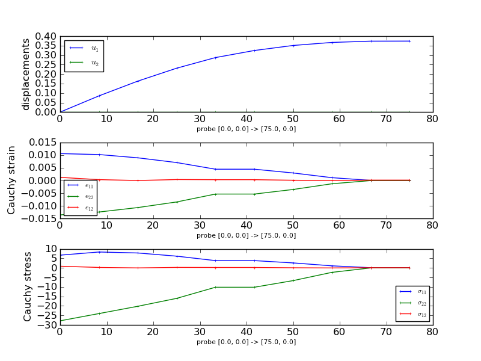

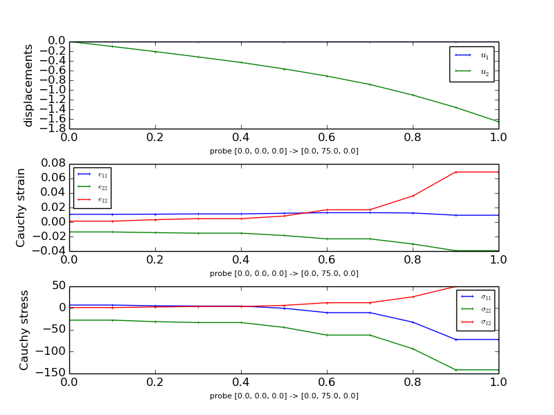

The probing function also generates previews of the mesh with the probe paths.

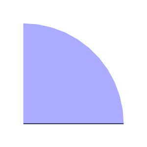

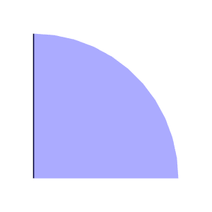

.. _primer-interactive-example:

Interactive Example
-------------------

*SfePy* can be used also interactively by constructing directly the classes that
corresponds to the keywords in the problem description files. The following
listing shows a script with the same (and more) functionality as the above
examples:

.. literalinclude:: /../examples/linear_elasticity/its2D_interactive.py

The script can be run from the *SfePy* top-level directory, assuming the
in-place build, as follows::

    python examples/linear_elasticity/its2D_interactive.py

The script allows setting several parameters that influence the solution, see::

    python examples/linear_elasticity/its2D_interactive.py -h

for the complete list. Besides the material parameters, a uniform mesh
refinement level and the displacement field approximation order can be
specified. The script demonstrates how to

- project a derived quantity, that is evaluated in quadrature points (e.g. a
  strain or stress), into a field variable;
- probe the solution defined in the field variables.

Using :mod:`sfepy.discrete.probes` allows correct probing of fields with the
approximation order greater than one.

The end.
