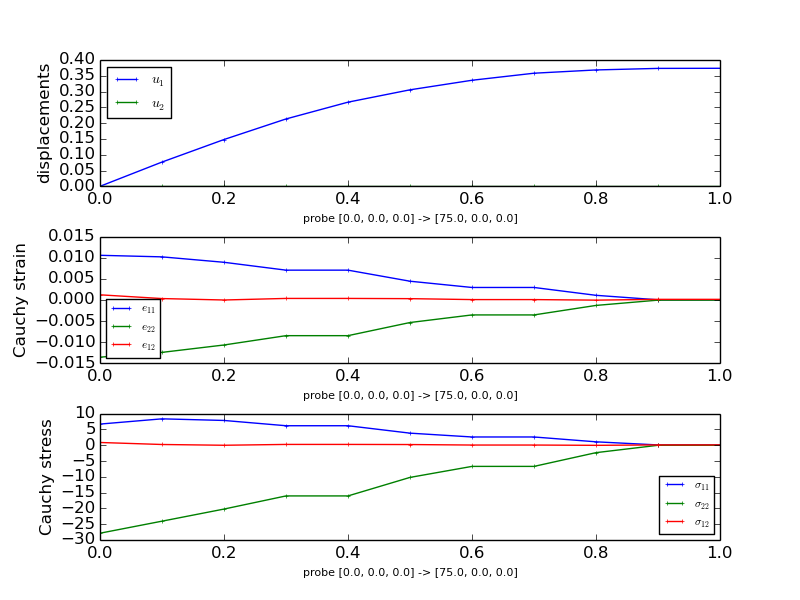

.. highlight:: python
   :linenothreshold: 3

.. _sec-primer:

Primer
======

.. contents:: Table of Contents
   :local:
   :backlinks: top

A beginner's tutorial highlighting the basics of *SfePy*.

Introduction
------------

This primer presents a step-by-step walk-through of the process to solve
a simple mechanics problem. The typical process to solve a problem using
*SfePy* is followed: a model is meshed, a problem definition file is
drafted, *SfePy* is run to solve the problem and finally the results of
the analysis are visualised.

Problem statement
^^^^^^^^^^^^^^^^^

A popular test to measure the tensile strength of concrete or asphalt
materials is the indirect tensile strength (ITS) test pictured below. In
this test a cylindrical specimen is loaded across its diameter to
failure. The test is usually run by loading the specimen at a constant
deformation rate of 50 mm/minute (say) and measuring the load
response. When the tensile stress that develops in the specimen under
loading exceeds its tensile strength then the specimen will fail. To
model this problem using finite elements the indirect tensile test can
be simplified to represent a diametrically point loaded disk as shown in
the schematic.

.. image:: images/primer/ITS.png
   :width: 20 %
   :align: left
.. image:: images/primer/ITS2D.png
   :width: 20 %
   :align: right

The tensile and compressive stresses that develop in the specimen as a
result of the point loads P are a function of the diameter (D) and
thickness (t) of the cylindrical specimen. At the centre of the
specimen, the compressive stress is 3 times the tensile stress and the
analytical formulation for these are, respectively:

.. math::
   :label: eq_tensile_stress

   \sigma_t=\frac{2P}{\pi tD}

.. math::
   :label: eq_compressive_stress

   \sigma_c=\frac{6P}{\pi tD}

These solutions may be approximated using finite element methods. To
solve this problem using *SfePy* the first step is meshing a suitable
model.

Meshing
-------

Assuming plane strain conditions, the indirect tensile test may be
modelled using a 2-D finite element mesh. Furthermore, the geometry of
the model is symmetrical about the x- and y-axes passing through the
centre of the circle. To take advantage of this symmetry only one
quarter of the 2-D model will be meshed and boundary conditions will be
established to indicate this symmetry. The meshing program `gmsh
<http://geuz.org/gmsh/>`_ is used here to very quickly mesh the
model. Follow these steps to model the ITS:

#. The ITS specimen has a diameter of 150 mm. Using *Gmsh* add three new
   points (geometry elementary entities) at the following coordinates:
   (0.0 0.0), (75.0,0.0) and (0.0,75.0).
#. Next add two straight lines connecting the points.
#. Next add a Circle arc connecting two of the points to form the
   quarter circle segment.
#. Still under *Geometry* add a ruled surface.
#. With the geometry of the model defined, add a mesh by clicking on the
   2D button under the Mesh functions.

The figures that follow show the various stages in the model process.

.. image:: images/primer/mesh1.png
   :width: 20 %
.. image:: images/primer/mesh2.png
   :width: 20 %
.. image:: images/primer/mesh3.png
   :width: 20 %
.. image:: images/primer/mesh4.png
   :width: 20 %

That's the meshing done. Save the mesh in a format that *SfePy*
recognizes. For now use the **medit** .mesh format e.g. its2D.mesh.

**Hint:** Check the drop down in the *Save As* dialog for the different
formats that Gmsh can save to.

If you open the its2D.mesh file using a text editor you'll notice that
*Gmsh* saves the mesh in a 3-D format and includes some extra geometry
items that should be deleted. Reformatted the mesh file to a 2-D format
and delete the *Edges* block. Note that when you do this the file cannot
be reopened by *Gmsh* so it is always a good idea to also save your
meshes in *Gmsh's* native format as well (Shift-Ctrl-S). Click
:download:`here <../meshes/2d/its2D.mesh>` to download the reformatted
mesh file that will be used in the tutorial.

.. image:: images/primer/its2D_4.png
   :width: 40 %
   :align: right

You'll notice that the mesh contains 55 vertices (nodes) and 83 triangle
elements. The mesh file provides the coordinates of the nodes and the
element connectivity. It is important to note that node and element
numbering in *SfePy* start at 0 and not 1 as is the case in *Gmsh* and
some other meshing programs.

To view *.mesh* files you can use a demo of `medit
<http://www.ann.jussieu.fr/~frey/software.html>`_. After loading your
mesh file with medit you can see the node and element numbering by
pressing **P** and **F** respectively. The numbering in medit starts at
1 as shown. Thus the node at the center of the model in *SfePy*
numbering is 0, and elements 76 and 77 are connected to this node. Node
and element numbers can also be viewed in *Gmsh* - under the mesh option
under the Visibility tab enable the node and surface labels. Note that
the surface labels as numbered in *Gmsh* follow on from the line
numbering. So to get the corresponding element number in SfePy you'll
need to subtract the number of lines in the *Gmsh* file + 1. Confused
yet? Luckily, *SfePy* provides some useful mesh functions to indicate
which elements are connected to which nodes. Nodes and elements can also
be identified by defining regions, which is addressed later.

Another open source python option to view *.mesh* files is the
appropriately named `Python Mesh Viewer
<http://labs.freehackers.org/projects/pythonmeshviewer>`_.

The next step in the process is coding the *SfePy* problem definition file.

.. _primer_example_file:

Problem description
-------------------

The programming of the problem description file is well documented in
the *SfePy* :doc:`users_guide`. The problem description file used in the
tutorial follows:

.. literalinclude:: /../examples/linear_elasticity/its2D_1.py

:download:`Download </../examples/linear_elasticity/its2D_1.py>` and open
the file in your favourite python editor. Note that you may wish to
change the location of the output directory to somewhere on your
drive. You may also need to edit the mesh file name. For the analysis we
will assume that the material of the test specimen is linear elastic and
isotropic. We define two material constants i.e. Young's modulus and
Poisson's ratio. The material is assumed to be asphalt concrete having a
Young's modulus of 2,000 MPa and a Poisson's ration of 0.4.

**Note:** Be consistent in your choice and use of units. In the tutorial
we are using Newton (N), millimeters (mm) and megaPascal (MPa). The
:doc:`sfepy.mechanics.units <src/sfepy/mechanics/units>` module might
help you in determining which derived units correspond to given basic
units.

The following block of code defines regions on your mesh:

::

    regions = {
        'Omega' : ('all', {}),
        'Left' : ('nodes in (x < 0.001)', {}),
        'Bottom' : ('nodes in (y < 0.001)', {}),
        'Top' : ('node 2', {}),
    }

Four regions are defined:

    1. Omega: all the elements in the mesh
    2. Left: the y-axis
    3. Bottom: the x-axis
    4. Top: the topmost node. This is where the load is applied.

Having defined the regions these can be used in other parts of your
code. For example, in the definition of the boundary conditions:

::

    ebcs = {
        'XSym' : ('Bottom', {'u.1' : 0.0}),
        'YSym' : ('Left', {'u.0' : 0.0}),
        'Load' : ('Top', {'u.0' : 0.0, 'u.1' : -1.0}),
    }

Now the power of the regions entity becomes apparent. To ensure symmetry
about the x-axis, the vertical or y-displacement of the nodes in the
Bottom region are prevented or set to zero. Similarly, for symmetry
about the y-axis, any horizontal or displacement in the x-direction of
the nodes in the Left region or y-axis is prevented. Finally, to
indicate the response of the load, the topmost node (number 2) is given
a displacement of 1 mm downwards in the vertical or y-direction and
displacement of this node in the x-direction is restricted.

We provided the material constants in terms of Young's modulus and
Poisson's ratio, but the linear elastic isotropic equation used requires
as input Lamé’s parameters. The youngpoisson_to_lame function is thus
used for conversion. Note that to use this function it was necessary to
import the function into the code, which was done up front:

::

    from sfepy.mechanics.matcoefs import youngpoisson_to_lame

**Hint:** Check out the :doc:`sfepy.mechanics.matcoefs
<src/sfepy/mechanics/matcoefs>` module for other useful material related
functions.

That's it - we are now ready to solve the problem.

Running SfePy
-------------

One option to solve the problem is to run the SfePy simple.py script
from the command shell::

    $ ./simple.py its2D_1.py

**Note:** For the purpose of this tutorial it is assumed that the
problem definition file (its2D_1.py) is in the same directory as the
*simple.py* script. If you have the its2D_1.py file in another directory
then make sure you include the path to this file as well.

SfePy solves the problem and outputs the solution to the output path
(output_dir) provided in the script. The output file will be in the vtk
format by default if this is not explicitly specified and the name of
the output file will be the same as that used for the mesh file except
with the vtk extension i.e. its2D.vtk.

The vtk format is an ascii format. Open the file using a text
editor. You'll notice that the output file includes separate sections:

    * POINTS (these are the model nodes)
    * CELLS (the model element connectivity)
    * VECTORS (the node displacements in the x-, y- and z- directions.

Notice that the y-displacement of node 2 is -1.0 as we set it as a
boundary condition.

SfePy includes a script (postproc.py) to quickly view the solution. To
run this script you need to have `mayavi
<http://code.enthought.com/projects/mayavi/>`_ installed. From the
command line issue the following (with the correct paths)::

    $ ./postproc.py its2D.vtk

The *postproc.py* script generates the image shown below, which shows
the average displacements in the model. Cool, but we are more interested
in the stresses. To get these we need to modify the problem description
file and do some post-processing.

.. image:: images/primer/its2D_1.png
   :width: 40 %

Post-processing
---------------

*SfePy* provides functions to calculate stresses and strains. We'll
include a function to calculate these and update the problem material
definition and options to call this function as a
post_process_hook. Save this file as :download:`its2D_2.py
</../examples/linear_elasticity/its2D_2.py>`.

.. literalinclude:: /../examples/linear_elasticity/its2D_2.py

The updated file imports all of the previous definitions in
its2D_1.py. The stress function (de_cauchy_stress) requires as input the
stiffness tensor - thus it was necessary to update the materials
accordingly. The problem options were also updated to call the
stress_strain function as a post_process_hook.

Run SfePy to solve the updated problem and view the solution (assuring
the correct paths)::

    $ ./simple.py its2D_2.py
    $ ./postproc.py its2D.vtk

In addition to the node displacements, the vtk output shown below now
also includes the stresses and strains averaged in the elements:

.. image:: images/primer/its2D_2.png
   :width: 40 %

Remember the objective was to determine the stresses at the centre of
the specimen under a load P. The solution as currently derived is
expressed in terms of a global displacement vector (u). The global
(residual) force vector (f) is a function of the global displacement
vector and the global stiffness matrix (K) as: **f = Ku**. Let's
determine the force vector interactively.

Running SfePy in interactive mode
^^^^^^^^^^^^^^^^^^^^^^^^^^^^^^^^^

In addition to solving problems using the simple.py script you can also
run SfePy interactively. This requires that `iPython
<http://ipython.org/download.html>`_ be installed. To run *SfePy*
interactively, use *isfepy*::

    $ ./isfepy

Once isfepy loads up, issue the following command::

    In [1]: pb, state = pde_solve('its2D_2.py')

The problem is solved and the problem definition and solution are
provided in the *pb* and *state* variables, respectively. The solution,
or in this case, the global displacement vector (u), contains the x- and
y-displacements at the nodes in the 2D model::

    In [2]: u=state()

    In [3]: u
    Out[3]:
    array([ 0.        ,  0.        ,  0.22608933, ..., -0.12051821,
            0.05335311, -0.0677574 ])

    In [4]: u.shape
    Out[4]: (110,)

    In [5]: u.shape=(55,2)

    In [6]: u
    Out[6]:
    array([[ 0.        ,  0.        ],
           [ 0.22608933,  0.        ],
           [ 0.        , -1.        ],
           ...,
           [ 0.05272529, -0.13954334],
           [ 0.16780587, -0.12051821],
           [ 0.05335311, -0.0677574 ]])

**Note:** We have used the fact, that the state vector contains only one
variable (*u*). In general, the following can be used::

    In [7]: u = state.get_parts()['u']

    In [8]: u
    Out[8]:
    array([ 0.        ,  0.        ,  0.22608933, ..., -0.12051821,
            0.05335311, -0.0677574 ])

From the above it can be seen that *u* holds the displacements at the 55
nodes in the model and that the displacement at node 2 (on which the
load is applied) is indeed (0,-1) as prescribed. The global stiffness
matrix is saved in pb as a `sparse
<http://docs.scipy.org/doc/scipy/reference/sparse.html>`_ matrix::

    In [9]: K=pb.mtx_a

    In [10]: K
    Out[10]:
    <93x93 sparse matrix of type '<type 'numpy.float64'>'
            with 1063 stored elements in Compressed Sparse Row format>

    In [11]: print K
      (0, 0)	2443.95959851
      (0, 6)	-2110.99917491
      (0, 13)	-332.960423597
      (0, 14)	1428.57142857
      (1, 1)	4048.78343529
      (1, 2)	-1354.87004384
      (1, 51)	-609.367453538
      (1, 52)	-1869.0018791
      (1, 91)	-357.41672785
      (1, 92)	1510.24654193
      (2, 1)	-1354.87004384
      (2, 2)	4121.03202907
      (2, 3)	-1696.54911732
      (2, 47)	76.2400806561
      (2, 48)	-1669.59247304
      (2, 51)	-1145.85294856
      (2, 52)	2062.13955556
      (3, 2)	-1696.54911732
      (3, 3)	4410.17902905
      (3, 4)	-1872.87344838
      (3, 41)	-130.515009576
      (3, 42)	-1737.33263802
      (3, 47)	-710.241453776
      (3, 48)	1880.20135513
      (4, 3)	-1872.87344838
      :	:
      (90, 80)	-1610.0550578
      (90, 85)	-199.343680224
      (90, 86)	-2330.41406097
      (90, 89)	-575.80373408
      (90, 90)	7853.23899229
      (91, 1)	-357.41672785
      (91, 7)	1735.59411191
      (91, 49)	-464.976034459
      (91, 50)	-1761.31189004
      (91, 51)	-3300.45367361
      (91, 52)	1574.59387937
      (91, 87)	-250.325600254
      (91, 88)	1334.11823335
      (91, 91)	9219.18643706
      (91, 92)	-2607.52659081
      (92, 1)	1510.24654193
      (92, 7)	-657.361661955
      (92, 49)	-1761.31189004
      (92, 50)	54.1134516246
      (92, 51)	1574.59387937
      (92, 52)	-315.793227627
      (92, 87)	1334.11823335
      (92, 88)	-4348.13351285
      (92, 91)	-2607.52659081
      (92, 92)	9821.16012014

    In [12]: K.shape
    Out[12]: (93, 93)

One would expect the shape of the global stiffness matrix (K) to be
(110,110) i.e. to have the same number of rows and columns as *u*. This
matrix has been reduced by the fixed degrees of freedom imposed by the
boundary conditions set at the nodes on symmetry axes. To restore the
matrix, temporarily remove the imposed boundary conditions::

    In [13]: pb.remove_bcs()
    sfepy: updating variables...
    sfepy: ...done
    sfepy: updating materials...
    sfepy:     Asphalt
    sfepy: ...done in 0.00 s

Now we can calculate the force vector (f)::

    In [14]: f=pb.evaluator.eval_residual(u)

    In [15]: f.shape
    Out[15]: (110,)

    In [16]: f
    Out[16]:
    array([ -2.86489070e+01,   8.63500981e+01,  -1.33101431e-13, ...,
             1.35003120e-13,  -5.32907052e-14,   4.26325641e-14])

Remember to restore the original boundary conditions previously removed
in step [13]::

    In [17]: pb.time_update()

To view the residual force vector, we can save it to a vtk file. This
requires creating a state and set its DOF vector to *f* as follows::

    In [18]: state = pb.create_state()

    In [19]: state.set_full(f)

    In [20]: out = state.create_output_dict()

    In [21]: pb.save_state('file.vtk', out=out)

Running the *postproc.py* script on file.vtk displays the average nodal
forces as shown below.

.. image:: images/primer/its2D_3.png
   :width: 40 %

The forces in the x- and y-directions at node 2 are::

    In [22]: f.shape = (55,2)

    In [23]: f[2]
    Out[23]: array([ 375.26022639, -604.89425239])

Great, we have the vertical load or force apparent at node 2
i.e. 604.894 Newton. Since we modelled the problem using symmetry, the
actual load applied to achieve the nodal displacement of 1 mm is 2 x
604.894 = 1209.7885 N. Applying the indirect tensile strength stress
equation, the horizontal tensile stress at the centre of the specimen
per unit thickness is 5.1345 MPa/mm and the vertical compressive stress
per unit thickness is 15.4035 MPa/mm. The per unit thickness results are
in terms of the plane strain conditions assumed for the 2D model.

Generating output at element nodes
^^^^^^^^^^^^^^^^^^^^^^^^^^^^^^^^^^

Previously we had calculated the stresses in the model but these were
averaged from those calculated at Gauss quadrature points within the
elements. It is possible to provide custom integrals to allow the
calculation of stresses with the Gauss quadrature points at the element
nodes. This will provide us a more accurate estimate of the stress at
the centre of the specimen located at node 0. The :download:`code
</../examples/linear_elasticity/its2D_3.py>` below outlines one way to
achieve this.

.. literalinclude:: /../examples/linear_elasticity/its2D_3.py

The output::

    ==================================================================
    Load to give 1 mm displacement = 1209.789 Newton

    Analytical solution approximation
    =================================
    Horizontal tensile stress = 5.135 MPa/mm
    Vertical compressive stress = 15.404 MPa/mm

    FEM solution
    ============
    Horizontal tensile stress = 4.58 MPa/mm
    Vertical compressive stress = 15.646 MPa/mm
    ==================================================================

Not bad for such a coarse mesh! Re-running the problem using a
:download:`finer mesh <../meshes/2d/big.mesh>` provides a more accurate
solution::

    ==================================================================
    Load to give 1 mm displacement = 740.779 Newton

    Analytical solution approximation
    =================================
    Horizontal tensile stress = 3.144 MPa/mm
    Vertical compressive stress = 9.432 MPa/mm

    FEM solution
    ============
    Horizontal tensile stress = 3.148 MPa/mm
    Vertical compressive stress = 9.419 MPa/mm
    ==================================================================

The above analytical solution approximation is computed using the
relations :eq:`eq_tensile_stress`, :eq:`eq_compressive_stress` with
the point load :math:`P` approximated by finite element residual in the top
node. That is why its value depends on the mesh size. To see this
dependence, try to play with the uniform mesh refinement level in the
:ref:`primer_example_file` file, namely lines 25, 26::

    refinement_level = 0
    filename_mesh = refine_mesh(filename_mesh, refinement_level)

To wrap this tutorial up let's explore *SfePy*'s probing functions.

Probing
-------

As a bonus for sticking to the end of this tutorial see the following
:download:`problem definition file
</../examples/linear_elasticity/its2D_4.py>` that provides *SfePy*
functions to quickly and neatly probe the solution.

.. literalinclude:: /../examples/linear_elasticity/its2D_4.py

Probing applies interpolation to output the solution along specified
paths. For the tutorial, line probing is done along the x- and y-axes of
the model.

Notice that the output_format has been defined as h5. To apply probing
first solve the problem as usual::

    $ ./simple.py its2D_4.py

This will write the solution to the output directory indicated. Then run
the *SfePy* probe.py script on the solution::

    $ ./probe.py its2D_4.py <sfepy output path>/its2D.h5

The results of the probing will be written to text files and the
following figures will be generated. These figures show the
displacements, normal stresses and strains as well as shear stresses and
strains along the probe paths. Note that you need `matplotlib
<http://matplotlib.sourceforge.net/>`_ installed to run this script.

The end.
