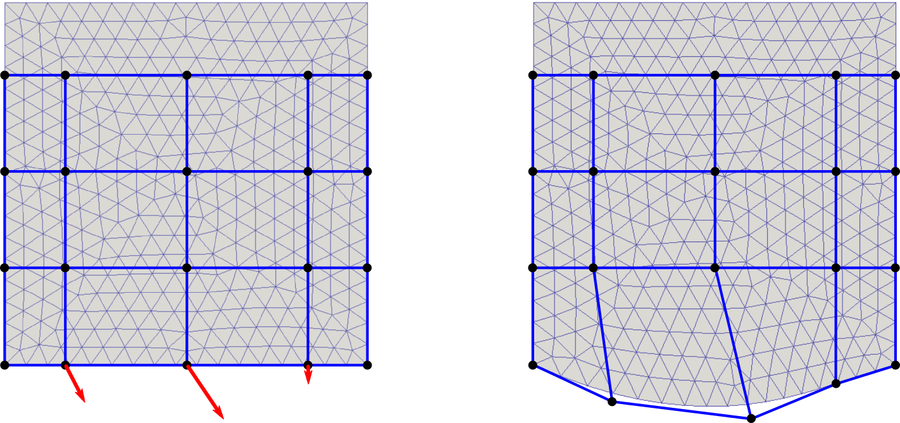
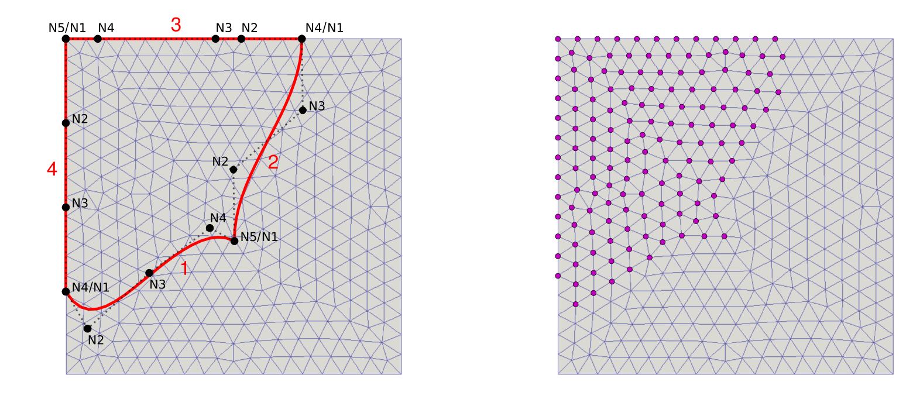
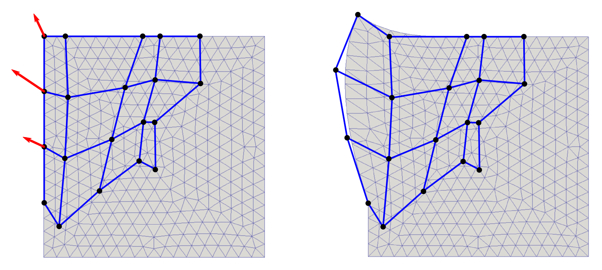

.. highlight:: python
   :linenothreshold: 3

.. include:: links.inc

.. _sec-splinebox:

Mesh parametrization
====================

.. only:: html

   .. contents:: Table of Contents
      :local:
      :backlinks: top

Introduction
------------

When dealing with shape optimization we usually need to modify a FE mesh using a
few optimization parameters describing the mesh geometry. The B-spline
parametrization offers an efficient way to do that. A mesh region (2D or 3D)
that is to be parametrized is enclosed in the so called spline-box and the
positions of all vertices inside the box can be changed by moving the control
points of the B-spline curves.

There are two different classes for the B-spline parametrization implemented in
*SfePy* (module :mod:`sfepy.mesh.splinebox`): ``SplineBox`` and
``SplineRegion2D``. The first one defines a rectangular parametrization box in
2D or 3D while the second one allows to set up an arbitrary shaped region of
parametrization in 2D.

SplineBox
---------

The rectangular B-spline parametrization is created as follows::

    from sfepy.mesh.splinebox import SplineBox

    spb = SplineBox(<bbox>, <coors>, <nsg>)

the first parameter defines the range of the box in each dimension, the second
parameter is the array of coordinates (vertices) to be parametrized and the
last one (optional) determines the number of control points in each dimension.
The number of the control points (:math:`ncp`) is calculated as:

.. math::
   :label: ncp

   ncp_i = nsg_i + degree,\qquad i = 1,2(,3)

where :math:`degree` is the degree of the B-spline curve (default value: 3 =
cubic spline) and :math:`nsg` is the number of the spline segments (default
value: [1,1(,1)] = 4 control points for all dimensions).

The position of the vertices can be modified by moving the control points::

    spb.move_control_point(<cpoint>, <val>)

where <cpoint> is the index or position of the control point, for explanation
see the following figure.

The displacement is given by <val>. The modified coordinates of the vertices
are evaluated by::

    new_coors = spb.evaluate()

Example
^^^^^^^

* Create a new 2D ``SplineBox`` with the left bottom corner at [-1,-1] and the right
  top corner at [1, 0.6] which has 5 control points in *x*-direction and 4
  control points in *y*-direction::

    from sfepy.mesh.splinebox import SplineBox
    from sfepy.discrete.fem import Mesh

    mesh = Mesh.from_file('meshes/2d/square_tri1.mesh')
    spb = SplineBox([[-1, 1], [-1, 0.6]], mesh.coors, nsg=[2,1])

* Modify the position of mesh coordinates by moving three control points (with
  indices 1,2 and 3)::

    spb.move_control_point(1, [0.1, -0.2])
    spb.move_control_point(2, [0.2, -0.3])
    spb.move_control_point(3, [0.0, -0.1])

* Evaluate the new coordinates::

    mesh.cmesh.coors[:] = spb.evaluate()

* Write the deformed mesh and the spline control net (the net of control points)
  into vtk files::

    spb.write_control_net('square_tri1_spbox.vtk')
    mesh.write('square_tri1_deform.vtk')

The following figures show the undeformed (left) and deformed (right) mesh and
the control net.

SplineRegion2D
--------------

In this case, the region (only in 2D) of parametrization is defined by four
B-spline curves::

    from sfepy.mesh.splinebox import SplineRegion2D

    spb = SplineRegion2D([<bspl1>, <bspl2>, <bspl3>, <bspl4>], <coors>)

The curves must form a closed loop, must be oriented counterclockwise and the
opposite curves (<bspl1>, <bspl3> and <bspl2>, <bspl4>) must have the same
number of control points and the same knot vectors, see the figure below, on
the left.

The position of the selected vertices, depicted in the figure on the right, are
driven by the control points in the same way as explained above for
``SplineBox``.

**Note:** Initializing ``SplineRegion2D`` may be time consuming due to the fact
that for all vertex coordinates the spline parameters have to be found using
an optimization method in which the B-spline basis is repeatedly evaluated.

Example
^^^^^^^

* First of all, define four B-spline curves (the default degree of the spline
  curve is 3) representing the boundary of a parametrization area::

    from sfepy.mesh.bspline import BSpline

    # left / right boundary
    line_l = nm.array([[-1, 1], [-1, .5], [-1, 0], [-1, -.5]])
    line_r = nm.array([[0, -.2], [.1, .2], [.3, .6], [.4, 1]])

    sp_l = BSpline()
    sp_l.approximate(line_l, ncp=4)
    kn_lr = sp_l.get_knot_vector()

    sp_r = BSpline()
    sp_r.approximate(line_r, knots=kn_lr)

    # bottom / top boundary
    line_b = nm.array([[-1, -.5], [-.8, -.6], [-.5, -.4], [-.2, -.2], [0, -.2]])
    line_t = nm.array([[.4, 1], [0, 1], [-.2, 1], [-.6, 1], [-1, 1]])

    sp_b = BSpline()
    sp_b.approximate(line_b, ncp=5)
    kn_bt = sp_b.get_knot_vector()

    sp_t = BSpline()
    sp_t.approximate(line_t, knots=kn_bt)

* Create a new 2D ``SplineRegion2D`` object::

    from sfepy.mesh.splinebox import SplineRegion2D

    spb = SplineRegion2D([sp_b, sp_r, sp_t, sp_l], mesh.coors)

* Move the control points::

    spb.move_control_point(5, [-.2, .1])
    spb.move_control_point(10, [-.3, .2])
    spb.move_control_point(15, [-.1, .2])

* Evaluate the new coordinates::

    mesh.cmesh.coors[:] = spb.evaluate()

The figures below show the undeformed (left) and deformed (right) mesh and
the control net.

