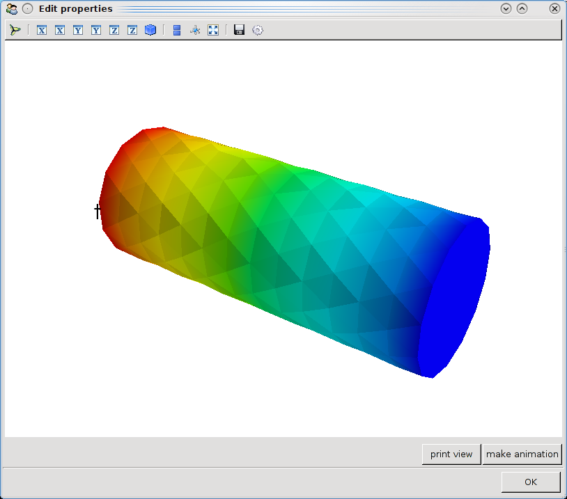
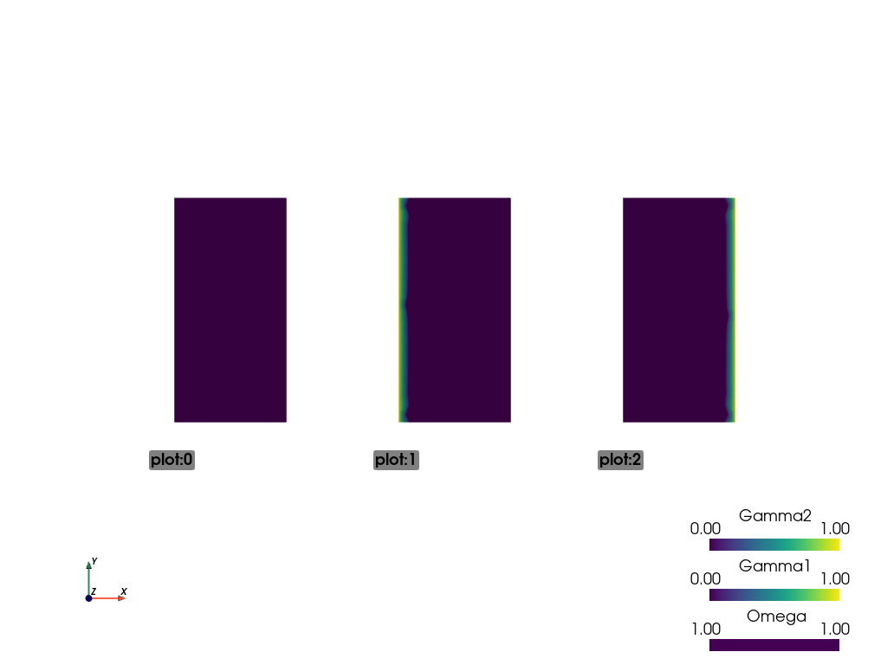
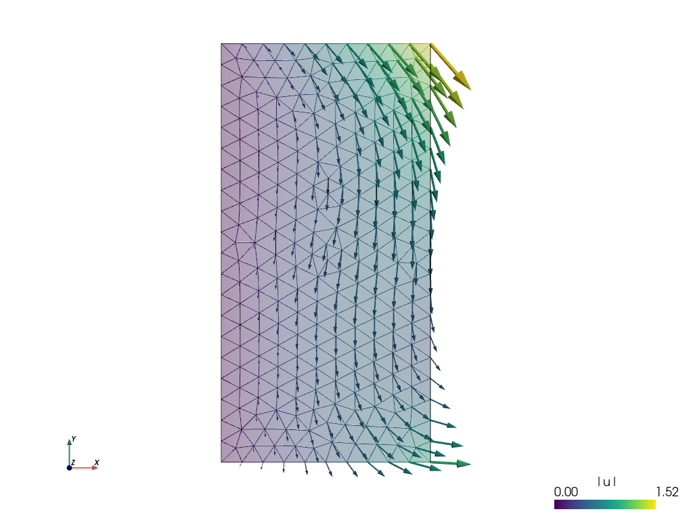
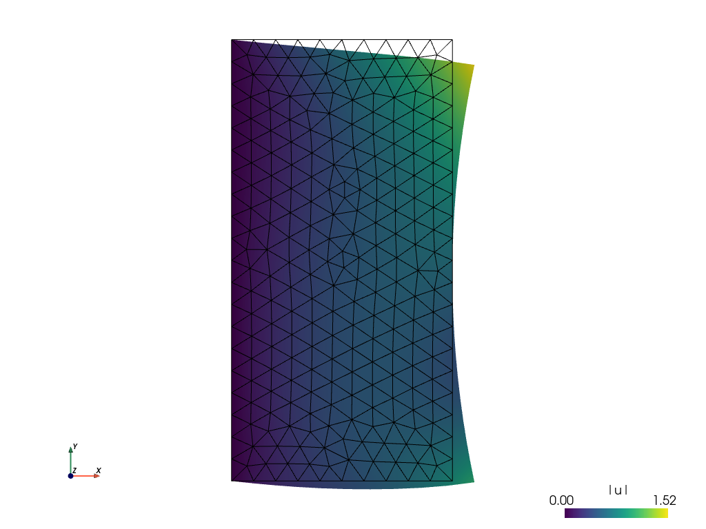

.. include:: links.inc

.. _sec-tutorial:

Tutorial
========

.. only:: html

   .. contents:: Table of Contents
      :local:
      :backlinks: top

Basic *SfePy* Usage
-------------------

*SfePy* package can be used in two basic ways as a:

#. Black-box Partial Differential Equation (PDE) solver,
#. Python package to build custom applications
   involving solving PDEs by the Finite Element Method (FEM).

This tutorial focuses on the first way and introduces the basic concepts
and nomenclature used in the following parts of the documentation. Check
also the :doc:`primer` which focuses on a particular problem in detail.

Users not familiar with the finite element method should start with the
:ref:`sec-solving-pdes-fem`.

.. _invoking_from_command_line:

Invoking *SfePy* from the Command Line
^^^^^^^^^^^^^^^^^^^^^^^^^^^^^^^^^^^^^^

This section introduces the basics of running *SfePy* from the command line.

The script `simple.py` is the **most basic starting point** in *SfePy*. It can
be invoked in many (similar) ways which depends on used OS, Python distribution
and *SfePy* build method (see :ref:`installing_sfepy` for further info). All
(working) alternatives described below are interchangeable, so don't panic and
feel free to pick your preferred choice (see :ref:`basic-usage` for further
explanation and more usage examples).

Depending on selected build method and OS used we recommend for:

* In-place build

  Use the top-level directory of *SfePy* source tree as your working directory
  and use::

    ./simple.py <problem_description_file>

  or (particularly on Windows based systems) ::

    python ./simple.py <problem_description_file>

* Installed (local or system-wide) build

  Use any working directory including your `problem description file` and use::

    python <path/to/installed/simple.py> <problem_description_file>

  or simply (on Unix based systems) ::

    <path/to/installed/simple.py> <problem_description_file>

  You can also use the simple *SfePy* `command-wrapper` (ensure that *SfePy*
  installation `executable` directory is included in your PATH)::

    sfepy-run simple <problem_description_file>

Please note, that improper mixing of `in-place` and `install` builds on single
command line may result in strange runtime errors.

Using *SfePy* Interactively
^^^^^^^^^^^^^^^^^^^^^^^^^^^

All functions of *SfePy* package can be also used interactively (see
:ref:`sec-interactive-example-linear-elasticity` for instance).

We recommend to use the `IPython`_ interactive shell for the best fluent user
experience. You can customize your `IPython` startup profile as described in
:ref:`using-ipython`.

Basic Notions
-------------

The simplest way of using *SfePy* is to solve a system of PDEs defined
in a `problem description file`, also referred to as `input
file`. In such a file, the problem is described using several keywords
that allow one to define the equations, variables, finite element
approximations, solvers and solution domain and subdomains (see
:ref:`sec-problem-description-file` for a full list of those keywords).

The syntax of the `problem description file` is very simple yet powerful,
as the file itself is just a regular Python module that can be normally
imported -- no special parsing is necessary. The keywords mentioned above
are regular Python variables (usually of the `dict` type) with special
names.

Below we show:

* how to solve a problem given by a problem description file, and
* explain the elements of the file on several examples.

But let us begin with a slight detour...

Sneak Peek: What is Going on Under the Hood
^^^^^^^^^^^^^^^^^^^^^^^^^^^^^^^^^^^^^^^^^^^

#. A top-level script (usually `simple.py` as in this tutorial) reads
   in an input file.

#. Following the contents of the input file, a `Problem` instance is created
   -- this is the input file coming to life. Let us call the instance
   `problem`.

   * The `Problem` instance sets up its domain,
     regions (various sub-domains), fields (the FE approximations), the
     equations and the solvers. The equations determine the materials and
     variables in use -- only those are fully instantiated, so the input
     file can safely contain definitions of items that are not used actually.

#. The solution is then obtained by calling `problem.solve()` function, which
   in turn calls a top-level time-stepping solver. In each step,
   `problem.time_update()` is called to setup boundary conditions, material
   parameters and other potentially time-dependent data. The
   `problem.save_state()` is called at the end of each time step to save the
   results. This holds also for stationary problems with a single "time step".

So that is it -- using the code a black-box PDE solver shields the user from
having to create the `Problem` instance by hand. But note that this is
possible, and often necessary when the flexibility of the default solvers is
not enough. At the end of the tutorial an example demonstrating the interactive
creation of the `Problem` instance is shown, see
:ref:`sec-interactive-example-linear-elasticity`.

Now let us continue with running a simulation.

Running a Simulation
--------------------

The following commands should be run in the top-level directory of the *SfePy*
source tree after compiling the C extension files. See
:ref:`introduction_installation` for full installation instructions.

* Download :download:`examples/diffusion/poisson_short_syntax.py
  <../examples/diffusion/poisson_short_syntax.py>`. It represents our sample
  *SfePy* :ref:`sec-problem-description-file`, which defines the problem to be
  solved in terms *SfePy* can understand.

* Use the downloaded file in place of `<problem_description_file.py>` and
  run `simple.py` as :ref:`described above <invoking_from_command_line>`.
  The successful execution of the command creates output
  file ``cylinder.vtk`` in the *SfePy* top-level directory.

.. _postprocessing:

Postprocessing the Results
^^^^^^^^^^^^^^^^^^^^^^^^^^

* The `postproc.py` script can be used for quick postprocessing and
  visualization of the *SfePy* output files. It requires `mayavi`_ installed
  on your system.

* As a simple example, try::

  ./postproc.py cylinder.vtk

* The following interactive 3D window should display:

* You can manipulate displayed image using:

  * the left mouse button by itself orbits the 3D view,
  * holding shift and the left mouse button pans the view,
  * holding control and the left mouse button rotates about the screen normal
    axis,
  * the right mouse button controls the zoom.

.. _poisson-example-tutorial:

Example Problem Description File
--------------------------------

Here we discuss the contents of the
:download:`examples/diffusion/poisson_short_syntax.py
<../examples/diffusion/poisson_short_syntax.py>` problem description file. For
additional examples, see the problem description files in the
``examples/`` directory of *SfePy*.

The problem at hand is the following:

.. math::
   :label: eq_laplace_static

    c \Delta T = f \mbox{ in }\Omega,\quad T(t) = \bar{T}(t)
    \mbox{ on } \Gamma \;,

where :math:`\Gamma \subseteq \Omega` is a subset of the domain :math:`\Omega`
boundary. For simplicity, we set :math:`f \equiv 0`, but we still work with
the material constant :math:`c` even though it has no influence on the
solution in this case. We also assume zero fluxes over :math:`\partial
\Omega \setminus \Gamma`, i.e. :math:`\pdiff{T}{\ul{n}} = 0` there.  The
particular boundary conditions used below are :math:`T = 2` on the left side
of the cylindrical domain depicted in the previous section and :math:`T = -2`
on the right side.

The first step to do is to write :eq:`eq_laplace_static` in *weak
formulation* :eq:`eq_wpoisson_final`. The :math:`f = 0`,
:math:`g = \pdiff{T}{\ul{n}} = 0`. So only one term in weak form
:eq:`eq_wpoisson_final` remains:

.. math::
   :label: eq_wlaplace_static

    \int_{\Omega} c\ \nabla T \cdot \nabla s = 0, \quad \forall s \in V_0 \;.

Comparing the above integral term with the
long table in :ref:`term_overview`, we can see that *SfePy* contains
this term under name `dw_laplace`. We are now ready to proceed to the
actual problem definition.

Open the :download:`examples/diffusion/poisson_short_syntax.py
<../examples/diffusion/poisson_short_syntax.py>` file in your favorite text
editor. Note that the file is a regular Python source code.

::

    from sfepy import data_dir

    filename_mesh = data_dir + '/meshes/3d/cylinder.mesh'

The `filename_mesh` variable points to the file containing the mesh for the
particular problem. *SfePy* supports a variety of mesh formats.

::

    materials = {
        'coef': ({'val' : 1.0},),
    }

Here we define just a constant coefficient :math:`c` of the Poisson
equation, using the `'values'` attribute. Other possible attribute is
`'function'` for material coefficients computed/obtained at runtime.

Many finite element problems require the definition of material parameters.
These can be handled in *SfePy* with material variables which associate the
material parameters with the corresponding region of the mesh.

::

   regions = {
       'Omega' : 'all', # or 'cells of group 6'
       'Gamma_Left' : ('vertices in (x < 0.00001)', 'facet'),
       'Gamma_Right' : ('vertices in (x > 0.099999)', 'facet'),
   }

Regions assign names to various parts of the finite element mesh. The region
names can later be referred to, for example when specifying portions of the
mesh to apply boundary conditions to. Regions can be specified in a variety of
ways, including by element or by node. Here, `'Omega'` is the elemental
domain over which the PDE is solved and `'Gamma_Left'` and `'Gamma_Right'`
define surfaces upon which the boundary conditions will be applied.

::

    fields = {
        'temperature': ('real', 1, 'Omega', 1)
    }

A field is used mainly to define the approximation on a (sub)domain, i.e. to
define the discrete spaces :math:`V_h`, where we seek the solution.

The Poisson equation can be used to compute e.g. a temperature distribution,
so let us call our field `'temperature'`. On the region `'Omega'`
it will be approximated using linear finite elements.

A field in a given region defines the finite element approximation.
Several variables can use the same field, see below.

::

    variables = {
        't': ('unknown field', 'temperature', 0),
        's': ('test field', 'temperature', 't'),
    }

One field can be used to generate discrete degrees of freedom (DOFs) of
several variables. Here the unknown variable (the temperature) is called
`'t'`, it's associated DOF name is `'t.0'` -- this will be referred
to in the Dirichlet boundary section (`ebc`). The corresponding test
variable of the weak formulation is called `'s'`. Notice that the
`'dual'` item of a test variable must specify the unknown it
corresponds to.

For each unknown (or state) variable there has to be a test (or virtual)
variable defined, as usual in weak formulation of PDEs.

::

    ebcs = {
        't1': ('Gamma_Left', {'t.0' : 2.0}),
        't2', ('Gamma_Right', {'t.0' : -2.0}),
    }

Essential (Dirichlet) boundary conditions can be specified as above.

Boundary conditions place restrictions on the finite element formulation and
create a unique solution to the problem. Here, we specify that a temperature of
+2 is applied to the left surface of the mesh and a temperature of -2 is
applied to the right surface.

::

    integrals = {
        'i': 2,
    }

Integrals specify which numerical scheme to use. Here we are using a 2nd order
quadrature over a 3 dimensional space.

::

    equations = {
        'Temperature' : """dw_laplace.i.Omega( coef.val, s, t ) = 0"""
    }

The equation above directly corresponds to the discrete version of
:eq:`eq_wlaplace_static`, namely:  Find :math:`\bm{t} \in V_h`, such that

.. math::
    \bm{s}^T (\int_{\Omega_h} c\ \bm{G}^T G) \bm{t} = 0, \quad
    \forall \bm{s} \in V_{h0} \;,

where :math:`\nabla u \approx \bm{G} \bm{u}`.

The equations block is the heart of the *SfePy* problem description file. Here,
we are specifying that the Laplacian of the temperature (in the weak
formulation) is 0, where `coef.val` is a material constant. We are using the
`'i'` integral defined previously, over the domain specified by the region
`'Omega'`.

The above syntax is useful for defining *custom integrals* with
user-defined quadrature points and weights, see :ref:`ug_integrals`. The
above uniform integration can be more easily achieved by::

    equations = {
        'Temperature' : """dw_laplace.2.Omega( coef.val, s, t ) = 0"""
    }

The integration order is specified directly in place of the integral
name. The integral definition is superfluous in this case.

::

   solvers = {
       'ls' : ('ls.scipy_direct', {}),
       'newton' : ('nls.newton',
                   {'i_max'      : 1,
                    'eps_a'      : 1e-10,
       }),
   }

Here, we specify the linear and nonlinear solver kinds and options. See
:mod:`sfepy.solvers.ls`, :mod:`sfepy.solvers.nls` and
:mod:`sfepy.solvers.ts_solvers` for available solvers and their parameters..
Even linear problems are solved by a nonlinear solver (KISS rule) -- only one
iteration is needed and the final residual is obtained for free. Note that we
do not need to define a time-stepping solver here - the problem is stationary
and the default ``'ts.stationary'`` solver is created automatically.

::

    options = {
        'nls' : 'newton',
        'ls' : 'ls',
    }

The solvers to use are specified in the options block. We can define multiple
solvers with different convergence parameters.

That's it! Now it is possible to proceed as described in
:ref:`invoking_from_command_line`.

.. _sec-interactive-example-linear-elasticity:

Interactive Example: Linear Elasticity
--------------------------------------

This example shows how to use *SfePy* interactively, but also how to make a
custom simulation script. We will use `IPython`_ interactive shell which
allows more flexible and intuitive work (but you can use standard Python
shell as well).

We wish to solve the following linear elasticity problem:

.. math::
   :label: eq_linear_elasticity

    - \pdiff{\sigma_{ij}(\ul{u})}{x_j} + f_i = 0 \mbox{ in }\Omega,
    \quad \ul{u} = 0 \mbox{ on } \Gamma_1,
    \quad u_1 = \bar{u}_1 \mbox{ on } \Gamma_2 \;,

where the stress is defined as :math:`\sigma_{ij} = 2 \mu e_{ij} +
\lambda e_{kk} \delta_{ij}`, :math:`\lambda`, :math:`\mu` are the Lamé's
constants, the strain is :math:`e_{ij}(\ul{u}) =
\frac{1}{2}(\pdiff{u_i}{x_j} + \pdiff{u_j}{x_i})` and :math:`\ul{f}` are
volume forces. This can be written in general form as
:math:`\sigma_{ij}(\ul{u}) = D_{ijkl} e_{kl}(\ul{u})`, where in our case
:math:`D_{ijkl} = \mu (\delta_{ik} \delta_{jl}+\delta_{il}
\delta_{jk}) + \lambda \ \delta_{ij} \delta_{kl}`.

In the weak form the equation :eq:`eq_linear_elasticity` is

.. math::
   :label: eq_wlinear_elasticity

    \int_{\Omega} D_{ijkl} e_{kl}(\ul{u}) e_{ij}(\ul{v}) + \int_{\Omega}
    f_i v_i = 0 \;,

where :math:`\ul{v}` is the test function, and both :math:`\ul{u}`,
:math:`\ul{v}` belong to a suitable function space.

**Hint:** Whenever you create a new object (e.g. a Mesh instance, see
below), try to print it using the `print` statement -- it will give you
insight about the object internals.

The whole example summarized in a script is available below in
:ref:`tutorial_interactive_source`.

In the *SfePy* top-level directory run ::

    ipython

.. sourcecode:: ipython

    In [1]: import numpy as nm
    In [2]: from sfepy.discrete.fem import Mesh, FEDomain, Field

Read a finite element mesh, that defines the domain :math:`\Omega`.

.. sourcecode:: ipython

    In [3]: mesh = Mesh.from_file('meshes/2d/rectangle_tri.mesh')

Create a domain. The domain allows defining regions or subdomains.

.. sourcecode:: ipython

    In [4]: domain = FEDomain('domain', mesh)

Define the regions -- the whole domain :math:`\Omega`, where the solution
is sought, and :math:`\Gamma_1`, :math:`\Gamma_2`, where the boundary
conditions will be applied. As the domain is rectangular, we first get a
bounding box to get correct bounds for selecting the boundary edges.

.. sourcecode:: ipython

    In [5]: min_x, max_x = domain.get_mesh_bounding_box()[:, 0]
    In [6]: eps = 1e-8 * (max_x - min_x)
    In [7]: omega = domain.create_region('Omega', 'all')
    In [8]: gamma1 = domain.create_region('Gamma1',
       ...:                               'vertices in x < %.10f' % (min_x + eps),
       ...:                               'facet')
    In [9]: gamma2 = domain.create_region('Gamma2',
       ...:                               'vertices in x > %.10f' % (max_x - eps),
       ...:                               'facet')

Next we define the actual finite element approximation using the
:class:`Field <sfepy.discrete.common.fields.Field>` class.

.. sourcecode:: ipython

    In [10]: field = Field.from_args('fu', nm.float64, 'vector', omega,
       ....:                         approx_order=2)

Using the field `fu`, we can define both the unknown variable :math:`\ub` and
the test variable :math:`\vb`.

.. sourcecode:: ipython

    In [11]: from sfepy.discrete import (FieldVariable, Material, Integral, Function,
       ....:                             Equation, Equations, Problem)

    In [12]: u = FieldVariable('u', 'unknown', field)
    In [13]: v = FieldVariable('v', 'test', field, primary_var_name='u')

Before we can define the terms to build the equation of linear
elasticity, we have to create also the materials, i.e. define the
(constitutive) parameters. The linear elastic material `m` will be
defined using the two Lamé constants :math:`\lambda = 1`, :math:`\mu =
1`. The volume forces will be defined also as a material as a constant
(column) vector :math:`[0.02, 0.01]^T`.

.. sourcecode:: ipython

    In [14]: from sfepy.mechanics.matcoefs import stiffness_from_lame

    In [15]: m = Material('m', D=stiffness_from_lame(dim=2, lam=1.0, mu=1.0))
    In [16]: f = Material('f', val=[[0.02], [0.01]])

One more thing needs to be defined -- the numerical quadrature that will
be used to integrate each term over its domain.

.. sourcecode:: ipython

    In [17]: integral = Integral('i', order=3)

Now we are ready to define the two terms and build the equations.

.. sourcecode:: ipython

    In [18]: from sfepy.terms import Term

    In [19]: t1 = Term.new('dw_lin_elastic(m.D, v, u)',
       ....:               integral, omega, m=m, v=v, u=u)

    In [20]: t2 = Term.new('dw_volume_lvf(f.val, v)',
       ....:               integral, omega, f=f, v=v)
    In [21]: eq = Equation('balance', t1 + t2)
    In [22]: eqs = Equations([eq])

The equations have to be completed by boundary conditions. Let us clamp
the left edge :math:`\Gamma_1`, and shift the right edge
:math:`\Gamma_2` in the :math:`x` direction a bit, depending on the
:math:`y` coordinate.

.. sourcecode:: ipython

   In [23]: from sfepy.discrete.conditions import Conditions, EssentialBC

   In [24]: fix_u = EssentialBC('fix_u', gamma1, {'u.all' : 0.0})
   In [25]: def shift_u_fun(ts, coors, bc=None, problem=None, shift=0.0):
      ....:                 val = shift * coors[:,1]**2
      ....:                 return val
   In [26]: bc_fun = Function('shift_u_fun', shift_u_fun,
      ....:                   extra_args={'shift' : 0.01})
   In [27]: shift_u = EssentialBC('shift_u', gamma2, {'u.0' : bc_fun})

The last thing to define before building the problem are the
solvers. Here we just use a sparse direct *SciPy solver* and the *SfePy
Newton solver* with default parameters. We also wish to store the
convergence statistics of the Newton solver. As the problem is linear
it should converge in one iteration.

.. sourcecode:: ipython

    In [28]: from sfepy.base.base import IndexedStruct
    In [29]: from sfepy.solvers.ls import ScipyDirect
    In [30]: from sfepy.solvers.nls import Newton

    In [31]: ls = ScipyDirect({})
    In [32]: nls_status = IndexedStruct()
    In [33]: nls = Newton({}, lin_solver=ls, status=nls_status)

Now we are ready to create a `Problem` instance.

.. sourcecode:: ipython

    In [34]: pb = Problem('elasticity', equations=eqs)

The :class:`Problem <sfepy.discrete.problem.Problem>` has several handy methods
for debugging. Let us try saving the regions into a VTK file.

.. sourcecode:: ipython

    In [35]: pb.save_regions_as_groups('regions')

And view them.

.. sourcecode:: ipython

    In [36]: from sfepy.postprocess.viewer import Viewer

    In [37]: view = Viewer('regions.vtk')
    In [38]: view()

You should see this:

Finally, we set the boundary conditions and the top-level solver , solve the
problem, save and view the results. For stationary problems, the top-level
solver needs not to be a time-stepping solver - when a nonlinear solver is set
instead, the default ``'ts.stationary'`` time-stepping solver is created
automatically.

.. sourcecode:: ipython

    In [39]: pb.set_bcs(ebcs=Conditions([fix_u, shift_u]))
    In [40]: pb.set_solver(nls)

    In [41]: status = IndexedStruct()
    In [42]: vec = pb.solve(status=status)

    In [43]: print('Nonlinear solver status:\n', nls_status)
    In [44]: print('Stationary solver status:\n', status)

    In [45]: pb.save_state('linear_elasticity.vtk', vec)
    In [46]: view = Viewer('linear_elasticity.vtk')
    In [47]: view()

This is the resulting image:

The default view is not very fancy. Let us show the displacements by
shifting the mesh. Close the previous window and do:

.. sourcecode:: ipython

    In [48]: view(vector_mode='warp_norm', rel_scaling=2,
       ...:       is_scalar_bar=True, is_wireframe=True)

And the result is:

See the docstring of `view()` and play with its options.

.. _tutorial_interactive_source:

Complete Example as a Script
^^^^^^^^^^^^^^^^^^^^^^^^^^^^

The source code: :download:`linear_elastic_interactive.py
<../examples/linear_elasticity/linear_elastic_interactive.py>`.

This file should be run from the top-level *SfePy* source directory so it can
find the mesh file correctly. Please note that the provided example script may
differ from above tutorial in some minor details.

.. literalinclude:: ../examples/linear_elasticity/linear_elastic_interactive.py
   :linenos:
