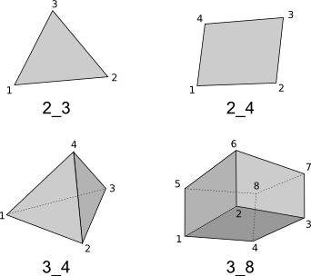

.. include:: links.inc

User's Guide
============

.. only:: html

   .. contents:: Table of Contents
      :local:
      :backlinks: top

This manual provides reference documentation to *SfePy* from a user's
perspective.

Running a Simulation
--------------------

The following should be run in the top-level directory of the *SfePy* source
tree after compiling the C extension files. See
:ref:`introduction_installation` for full installation instructions info. The
``$`` indicates the command prompt of your terminal.

.. _basic-usage:

Basic Usage
^^^^^^^^^^^

* ::

    $ ./simple.py examples/diffusion/poisson_short_syntax.py

  * Creates ``cylinder.vtk``

* ::

    $ ./simple.py examples/navier_stokes/stokes.py

  * Creates ``channels_symm944t.vtk``

* ::

    $ ./run_tests.py

  * See `Running Tests`_

Applications
^^^^^^^^^^^^

* Phononic Materials

  * ::

      $ ./phonon.py -p examples/phononic/band_gaps.py

    * see ``examples/phononic/output/``

.. _SfePy-command-wrapper:

Using Command Wrapper
^^^^^^^^^^^^^^^^^^^^^

All top-level *SfePy* scripts (applications) can be run via single
``sfepy-run`` wrapper::

  $ ./sfepy-run
  usage: sfepy-run [command] [options]

  Simple wrapper for main SfePy commands.

  positional arguments:
  {extractor,homogen,phonon,postproc,probe,run_tests,simple}
                        Available SfePy command(s).
  options               Additional options passed directly to selected
                        [command].

  optional arguments:
  -h, --help            show this help message and exit
  -v, --version         show program's version number and exit
  -w, --window          use alternative (pythonw) interpreter

Notes
"""""

* This is a "new" supported method. Any *SfePy* script can be still
  run as stand-alone (as mentioned above).
* Both "inplace" and "system-wide" installations are supported.

Stand-Alone Examples
^^^^^^^^^^^^^^^^^^^^

* ::

    $ python examples/rs_correctors.py

* ::

    $ python examples/compare_elastic_materials.py

* ::

    $ python examples/live_plot.py

Running Tests
^^^^^^^^^^^^^

The tests are run by the ``run_tests.py`` script. Run

    $ ./run_tests.py -h

to get help.

Common Tasks
""""""""""""

* Run all tests, filter output; result files related to the tests can be found
  in output-tests directory::

    ./run_tests.py
    ./run_tests.py --filter-more
    ./run_tests.py --filter-less

* Run a particular test file, filter output::

    # Test if linear elasticity input file works.
    ./run_tests.py tests/test_input_le.py

* Debug a failing test by automatically starting a debugger when/if an
  exception is raised ::

    ./run_tests.py tests/test_input_le.py --debug

* Raise silenced exceptions that could have occurred in a failing test::

    ./run_tests.py tests/test_input_le.py --raise

Computations and Examples
^^^^^^^^^^^^^^^^^^^^^^^^^

The example problems in the ``examples`` directory can be computed by the script
``simple.py`` which is in the top-level directory of the *SfePy* distribution.
If it is run without arguments, a help message is printed::

    $ ./simple.py
    Usage: simple.py [options] filename_in

    Solve partial differential equations given in a SfePy problem definition file.

    Example problem definition files can be found in ``examples/`` directory of the
    SfePy top-level directory. This script works with all the examples except those
    in ``examples/standalone/``.

    Both normal and parametric study runs are supported. A parametric study allows
    repeated runs for varying some of the simulation parameters - see
    ``examples/diffusion/poisson_parametric_study.py`` file.

    Options:
      --version             show program's version number and exit
      -h, --help            show this help message and exit
      -c "key : value, ...", --conf="key : value, ..."
                            override problem description file items, written as
                            python dictionary without surrounding braces
      -O "key : value, ...", --options="key : value, ..."
                            override options item of problem description, written
                            as python dictionary without surrounding braces
      -d "key : value, ...", --define="key : value, ..."
                            pass given arguments written as python dictionary
                            without surrounding braces to define() function of
                            problem description file
      -o filename           basename of output file(s) [default: <basename of
                            input file>]
      --format=format       output file format, one of: {vtk, h5} [default: vtk]
      --save-restart=mode   if given, save restart files according to the given
                            mode.
      --load-restart=filename
                            if given, load the given restart file
      --log=file            log all messages to specified file (existing file will
                            be overwritten!)
      -q, --quiet           do not print any messages to screen
      --save-ebc            save a zero solution with applied EBCs (Dirichlet
                            boundary conditions)
      --save-ebc-nodes      save a zero solution with added non-zeros in EBC
                            (Dirichlet boundary conditions) nodes - scalar
                            variables are shown using colors, vector variables
                            using arrows with non-zero components corresponding to
                            constrained components
      --save-regions        save problem regions as meshes
      --save-regions-as-groups
                            save problem regions in a single mesh but mark them by
                            using different element/node group numbers
      --save-field-meshes   save meshes of problem fields (with extra DOF nodes)
      --solve-not           do not solve (use in connection with --save-*)
      --list=what           list data, what can be one of: {terms, solvers}

Additional (stand-alone) examples are in the examples/ directory, e.g.::

    $ python examples/compare_elastic_materials.py

Parametric study example::

    $ ./simple.py examples/diffusion/poisson_parametric_study.py

Common Tasks
""""""""""""

* Run a simulation::

    ./simple.py examples/diffusion/poisson_short_syntax.py
    ./simple.py examples/diffusion/poisson_short_syntax.py -o some_results # -> produces some_results.vtk

* Print available terms::

    ./simple.py --list=terms

* Run a simulation and also save Dirichlet boundary conditions::

    ./simple.py --save-ebc examples/diffusion/poisson_short_syntax.py # -> produces an additional .vtk file with BC visualization

* Use a restart file to continue an interrupted simulation:

  - **Warning:** This feature is preliminary and does not support terms with
    internal state.
  - Run::

      ./simple.py examples/large_deformation/balloon.py --save-restart=-1

    and break the computation after a while (hit Ctrl-C). The mode
    ``--save-restart=-1`` is currently the only supported mode. It saves a
    restart file for each time step, and only the last computed time step
    restart file is kept.
  - A file named ``'unit_ball.restart-??.h5'`` should be created, where ``'??'``
    indicates the last stored time step. Let us assume it is
    ``'unit_ball.restart-04.h5'``, i.e. the fifth step.
  - Restart the simulation by::

      ./simple.py examples/large_deformation/balloon.py --load-restart=unit_ball.restart-04.h5

    The simulation should continue from the next time step. Verify that by
    running::

      ./simple.py examples/large_deformation/balloon.py

    and compare the residuals printed in the corresponding time steps.

Visualization of Results
------------------------

The ``postproc.py`` script can be used for quick postprocessing and
visualization of the *SfePy* results. It requires mayavi2 installed on your
system. Running ``postproc.py`` without arguments produces::

    $ ./postproc.py
    Usage: postproc.py [options] filename

    This is a script for quick Mayavi-based visualizations of finite element
    computations results.

    Examples
    --------
      The examples assume that run_tests.py has been run successfully and the
      resulting data files are present.

      - view data in output-tests/test_navier_stokes.vtk

        $ python postproc.py output-tests/test_navier_stokes.vtk
        $ python postproc.py output-tests/test_navier_stokes.vtk --3d

      - create animation (forces offscreen rendering) from
        output-tests/test_time_poisson.*.vtk

        $ python postproc.py output-tests/test_time_poisson.*.vtk -a mov

      - create animation (forces offscreen rendering) from
        output-tests/test_hyperelastic.*.vtk

        The range specification for the displacements 'u' is required, as
        output-tests/test_hyperelastic.00.vtk contains only zero
        displacements which leads to invisible glyph size.

        $ python postproc.py output-tests/test_hyperelastic.*.vtk                          --ranges=u,0,0.02 -a mov

      - same as above, but slower frame rate

        $ python postproc.py output-tests/test_hyperelastic.*.vtk                          --ranges=u,0,0.02 -a mov --ffmpeg-options="-r 2 -sameq"

    Options:
      --version             show program's version number and exit
      -h, --help            show this help message and exit
      -l, --list-ranges     do not plot, only list names and ranges of all data
      -n, --no-show         do not call mlab.show()
      --no-offscreen        force no offscreen rendering for --no-show
      --3d                  3d plot mode
      --view=angle,angle[,distance[,focal_point]]
                            camera azimuth, elevation angles, and optionally also
                            distance and focal point coordinates (without []) as
                            in `mlab.view()` [default: if --3d is True: "45,45",
                            else: "0,0"]
      --roll=angle          camera roll angle [default: 0.0]
      --fgcolor=R,G,B       foreground color, that is the color of all text
                            annotation labels (axes, orientation axes, scalar bar
                            labels) [default: 0.0,0.0,0.0]
      --bgcolor=R,G,B       background color [default: 1.0,1.0,1.0]
      --layout=layout       layout for multi-field plots, one of: rowcol, colrow,
                            row, col [default: rowcol]
      --scalar-mode=mode    mode for plotting scalars with --3d, one of:
                            cut_plane, iso_surface, both [default: iso_surface]
      --vector-mode=mode    mode for plotting vectors, one of: arrows, norm,
                            arrows_norm, warp_norm [default: arrows_norm]
      -s scale, --scale-glyphs=scale
                            relative scaling of glyphs (vector field
                            visualization) [default: 0.05]
      --clamping            glyph clamping mode
      --ranges=name1,min1,max1:name2,min2,max2:...
                            force data ranges [default: automatic from data]
      -b, --scalar-bar      show scalar bar for each data
      --wireframe           show wireframe of mesh surface for each data
      --opacity=opacity     global surface and wireframe opacity in [0.0, 1.0]
                            [default: 1.0]
      --rel-text-width=width
                            relative text annotation width [default: 0.02]
      -w, --watch           watch the results file for changes (single file mode
                            only)
      -o filename, --output=filename
                            view image file name [default: 'view.png']
      --output-dir=directory
                            output directory for saving view images; ignored when
                            -o option is given, as the directory part of the
                            filename is taken instead [default: '.']
      -a <ffmpeg-supported format>, --animation=<ffmpeg-supported format>
                            if set to a ffmpeg-supported format (e.g. mov, avi,
                            mpg), ffmpeg is installed and results of multiple time
                            steps are given, an animation is created in the same
                            directory as the view images
      --ffmpeg-options="<ffmpeg options>"
                            ffmpeg animation encoding options (enclose in "")
                            [default: -r 10 -sameq]
      -r resolution, --resolution=resolution
                            image resolution in NxN format [default: shorter axis:
                            600; depends on layout: for rowcol it is 800x600]
      --all                 draw all data (normally, node_groups and mat_id are
                            omitted)
      --only-names=list of names
                            draw only named data
      --group-names=name1,...,nameN:...
                            superimpose plots of data in each group
      --subdomains=mat_id_name,threshold_limits,single_color
                            superimpose surfaces of subdomains over each data;
                            example value: mat_id,0,None,True
      --step=step           set the time step [default: 0]
      --anti-aliasing=value
                            value of anti-aliasing [default: mayavi2 default]
      -d 'var_name0,function_name0,par0=val0,par1=val1,...:var_name1,...', --domain-specific='var_name0,function_name0,par0=val0,par1=val1,...:var_name1,...'
                            domain specific drawing functions and configurations

As a simple example, try::

    $ ./simple.py examples/diffusion/poisson_short_syntax.py
    $ ./postproc.py cylinder.vtk

The following window should display:

.. image:: images/postproc_simple.png

The ``-l`` switch lists information contained in a results file, e.g.::

    $ ./postproc.py -l cylinder.vtk
    sfepy: 0: cylinder.vtk
    point scalars
      "node_groups" (354,) range: 0 0 l2_norm_range: 0.0 0.0
        "t" (354,) range: -2.0 2.0 l2_norm_range: 0.0106091 2.0
        cell scalars
          "mat_id" (1348,) range: 6 6 l2_norm_range: 6.0 6.0

.. _sec-problem-description-file:

Problem Description File
------------------------

Here we discuss the basic items that users have to specify in their input
files. For complete examples, see the problem description files in the
``examples/`` directory of SfePy.

Long Syntax
^^^^^^^^^^^

Besides the *short syntax* described below there is (due to history)
also a *long syntax* which is explained in
:doc:`problem_desc_file_long`. The short and long syntax can be mixed
together in one description file.

FE Mesh
^^^^^^^

A FE mesh defining a domain geometry can be stored in several formats:

* legacy VTK (``.vtk``)
* custom HDF5 file (``.h5``)
* medit mesh file (``.mesh``)
* tetgen mesh files (``.node``, ``.ele``)
* comsol text mesh file (``.txt``)
* abaqus text mesh file (``.inp``)
* avs-ucd text mesh file (``.inp``)
* hypermesh text mesh file (``.hmascii``)
* hermes3d mesh file (``.mesh3d``)
* nastran text mesh file (``.bdf``)
* gambit neutral text mesh file (``.neu``)
* salome/pythonocc med binary mesh file (``.med``)

**Example**::

    filename_mesh = 'meshes/3d/cylinder.vtk'

The VTK and HDF5 formats can be used for storing the results. The format
can be selected in options, see :ref:`miscellaneous_options`.

The following geometry elements are supported:

Regions
^^^^^^^

Regions serve to select a certain part of the computational domain using
topological entities of the FE mesh. They are used to define the boundary
conditions, the domains of terms and materials etc.

Let us denote D the maximal dimension of topological entities. For volume
meshes it is also the dimension of space the domain is embedded in. Then the
following topological entities can be defined on the mesh (notation follows
[Logg2012]_):

.. [Logg2012] A. Logg: Efficient Representation of Computational Meshes. 2012

.. csv-table::
   :header: topological entity, dimension, co-dimension
   :widths: 15, 15, 15

   vertex, 0, D
   edge, 1, D - 1
   face, 2, D - 2
   facet, D - 1, 1
   cell, D, 0

If D = 2, faces are not defined and facets are edges. If D = 3, facets are
faces.

Following the above definitions, a region can be of different `kind`:

- ``cell``, ``facet``, ``face``, ``edge``, ``vertex`` - entities of higher
  dimension are not included.
- ``cell_only``, ``facet_only``, ``face_only``, ``edge_only``,
  ``vertex_only`` - only the specified entities are included, other entities
  are empty sets, so that set-like operators still work, see below.
- The ``cell`` kind is the most general and should be used with volume
  terms. It is also the default if the kind is not specified in region
  definition.
- The ``facet`` kind (same as ``edge`` in 2D and ``face`` in 3D) is to be used
  with boundary (surface integral) terms.
- The ``vertex`` (same as ``vertex_only``) kind can be used with point-wise
  defined terms (e.g. point loads).

The kinds allow a clear distinction between regions of different purpose
(volume integration domains, surface domains, etc.) and could be uses to lower
memory usage.

A region definition involves `topological entity selections` combined with
`set-like operators`. The set-like operators can result in intermediate regions
that have the ``cell`` kind. The desired kind is set to the final region,
removing unneeded entities. Most entity selectors are defined in terms of
vertices and cells - the other entities are computed as needed.

.. list-table::
   :widths: 50, 50
   :header-rows: 1

   * - topological entity selection
     - explanation
   * - ``all``
     - all entities of the mesh
   * - ``vertices of surface``
     - surface of the mesh
   * - ``vertices of group <integer>``
     - vertices of given group
   * - ``vertices of set <str>``
     - vertices of a given named vertex set [#f1]_
   * - ``vertices in <expr>``
     - vertices given by an expression [#f2]_
   * - ``vertices by <function>``
     - vertices given by a function of coordinates [#f3]_
   * - ``vertex <id>[, <id>, ...]``
     - vertices given by their ids
   * - ``vertex in r.<name of another region>``
     - any single vertex in the given region
   * - ``cells of group <integer>``
     - cells of given group
   * - ``cells by <efunction>``
     - cells given by a function of coordinates [#f4]_
   * - ``cell <id>[, <id>, ...]``,
     - cells given by their ids
   * - ``copy r.<name of another region>``
     - a copy of the given region
   * - ``r.<name of another region>``
     - a reference to the given region

.. rubric:: topological entity selection footnotes

.. [#f1] Only if mesh format supports reading boundary condition vertices as
   vertex sets.
.. [#f2] ``<expr>`` is a logical expression like ``(y <= 0.1) & (x < 0.2)``. In
   2D use ``x``, ``y``, in 3D use ``x``, ``y`` and ``z``. ``&`` stands for
   logical and, ``|`` stands for logical or.
.. [#f3] ``<function>`` is a function with signature ``fun(coors,
         domain=None)``, where ``coors`` are coordinates of mesh vertices.
.. [#f4] ``<efunction>`` is a function with signature ``fun(coors,
         domain=None)``, where ``coors`` are coordinates of mesh cell
         centroids.

.. csv-table::
   :header: set-like operator, explanation
   :widths: 20, 20

   ``+v``, vertex union
   ``+e``, edge union
   ``+f``, face union
   ``+s``, facet union
   ``+c``, cell union
   ``-v``, vertex difference
   ``-e``, edge difference
   ``-f``, face difference
   ``-s``, facet difference
   ``-c``, cell difference
   ``*v``, vertex intersection
   ``*e``, edge intersection
   ``*f``, face intersection
   ``*s``, facet intersection
   ``*c``, cell intersection

Region Definition Syntax
""""""""""""""""""""""""

Regions are defined by the following Python dictionary::

        regions = {
            <name> : (<selection>, [<kind>], [<parent>], [{<misc. options>}]),
        }

or::

        regions = {
            <name> : <selection>,
        }

**Example definitions**::

      regions = {
          'Omega' : 'all',
          'Right' : ('vertices in (x > 0.99)', 'facet'),
          'Gamma1' : ("""(cells of group 1 *v cells of group 2)
                         +v r.Right""", 'facet', 'Omega'),
      }

The mirror region can be defined explicitly as::

      regions = {
        'Top': ('r.Y *v r.Surf1', 'facet', 'Y', {'mirror_region': 'Bottom'}),
        'Bottom': ('r.Y *v r.Surf2', 'facet', 'Y', {'mirror_region': 'Top'}),
      }

.. _User's Guide-Fields:

Fields
^^^^^^

Fields correspond to FE spaces::

          fields = {
              <name> : (<data_type>, <shape>, <region_name>, <approx_order>)
          }

where
  * <data_type> is a numpy type (float64 or complex128) or
    'real' or 'complex'
  * <shape> is the number of DOFs per node: 1 or (1,) or 'scalar', space
    dimension (2, or (2,) or 3 or (3,)) or 'vector'; it can be other
    positive integer than just 1, 2, or 3
  * <region_name> is the name of region where the field is defined
  * <approx_order> is the FE approximation order, e.g. 0, 1, 2, '1B' (1
    with bubble)

**Example**: scalar P1 elements in 2D on a region Omega::

        fields = {
            'temperature' : ('real', 1, 'Omega', 1),
        }

The following approximation orders can be used:

  * simplex elements: 1, 2, '1B', '2B'
  * tensor product elements: 0, 1, '1B'

  Optional bubble function enrichment is marked by 'B'.

Variables
^^^^^^^^^

Variables use the FE approximation given by the specified field::

        variables = {
            <name> : (<kind>, <field_name>, <spec>, [<history>])
        }

where
  * <kind> - 'unknown field', 'test field' or 'parameter field'
  * <spec> - in case of: primary variable - order in the global vector
    of unknowns, dual variable - name of primary variable
  * <history> - number of time steps to remember prior to current step

**Example**::

        variables = {
            't' : ('unknown field', 'temperature', 0, 1),
            's' : ('test field', 'temperature', 't'),
        }

.. _ug_integrals:

Integrals
^^^^^^^^^

Define the integral type and quadrature rule. This keyword is
optional, as the integration orders can be specified directly in
equations (see below)::

        integrals = {
            <name> : <order>
        }

where
  * <name> - the integral name - it has to begin with 'i'!
  * <order> - the order of polynomials to integrate, or 'custom' for
    integrals with explicitly given values and weights

**Example**::

        import numpy as nm
        N = 2
        integrals = {
            'i1' : 2,
            'i2' : ('custom', zip(nm.linspace( 1e-10, 0.5, N ),
                                  nm.linspace( 1e-10, 0.5, N )),
                    [1./N] * N),
        }

.. _User's Guide-EssentialBC:

Essential Boundary Conditions and Constraints
^^^^^^^^^^^^^^^^^^^^^^^^^^^^^^^^^^^^^^^^^^^^^

The essential boundary conditions set values of DOFs in some regions, while the
constraints constrain or transform values of DOFs in some regions.

Dirichlet Boundary Conditions
"""""""""""""""""""""""""""""

The Dirichlet, or essential, boundary conditions apply in a given region given
by its name, and, optionally, in selected times. The times can be given either
using a list of tuples `(t0, t1)` making the condition active for `t0 <= t <
t1`, or by a name of a function taking the time argument and returning True or
False depending on whether the condition is active at the given time or not.

Dirichlet (essential) boundary conditions::

    ebcs = {
        <name> : (<region_name>, [<times_specification>,]
                  {<dof_specification> : <value>[,
                   <dof_specification> : <value>, ...]})
    }

**Example**::

        ebcs = {
            'u1' : ('Left', {'u.all' : 0.0}),
            'u2' : ('Right', [(0.0, 1.0)], {'u.0' : 0.1}),
            'phi' : ('Surface', {'phi.all' : 0.0}),
        }

Periodic Boundary Conditions
""""""""""""""""""""""""""""

The periodic boundary conditions tie DOFs of a single variable in two regions
that have matching nodes. Can be used with functions in
:mod:`sfepy.discrete.fem.periodic`.

Periodic boundary conditions::

    epbcs = {
        <name> : ((<region1_name>, <region2_name>), [<times_specification>,]
                  {<dof_specification> : <dof_specification>[,
                   <dof_specification> : <dof_specification>, ...]},
                  <match_function_name>)
    }

**Example**::

        epbcs = {
            'up1' : (('Left', 'Right'), {'u.all' : 'u.all', 'p.0' : 'p.0'},
                     'match_y_line'),
        }

Linear Combination Boundary Conditions
""""""""""""""""""""""""""""""""""""""

The linear combination boundary conditions (LCBCs) are more general than the
Dirichlet BCs or periodic BCs. They can be used to substitute one set of DOFs
in a region by another set of DOFs, possibly in another region and of another
variable. The LCBCs can be used only in FEM with nodal (Lagrange) basis.

Available LCBC kinds:

- ``'rigid'`` - in linear elasticity problems, a region moves as a rigid body;
- ``'no_penetration'`` - in flow problems, the velocity vector is constrained
  to the plane tangent to the surface;
- ``'normal_direction'`` - the velocity vector is constrained to the normal
  direction;
- ``'edge_direction'`` - the velocity vector is constrained to the mesh edge
  direction;
- ``'integral_mean_value'`` - all DOFs in a region are summed to a single new
  DOF;
- ``'shifted_periodic'`` - generalized periodic BCs that work with two
  different variables and can have a non-zero mutual shift.

Only the ``'shifted_periodic'`` LCBC needs the second region and the DOF
mapping function, see below.

Linear combination boundary conditions::

        lcbcs = {
            'shifted' : (('Left', 'Right'),
                         {'u1.all' : 'u2.all'},
                         'match_y_line', 'shifted_periodic',
                         'get_shift'),
            'mean' : ('Middle', {'u1.all' : None}, None, 'integral_mean_value'),
        }

Initial Conditions
^^^^^^^^^^^^^^^^^^

Initial conditions are applied prior to the boundary conditions - no special
care must be used for the boundary dofs::

    ics = {
        <name> : (<region_name>, {<dof_specification> : <value>[,
                                  <dof_specification> : <value>, ...]},...)
    }

**Example**::

        ics = {
            'ic' : ('Omega', {'T.0' : 5.0}),
        }

Materials
^^^^^^^^^

Materials are used to define constitutive parameters (e.g. stiffness,
permeability, or viscosity), and other non-field arguments of terms (e.g. known
traction or volume forces). Depending on a particular term, the parameters can
be constants, functions defined over FE mesh nodes, functions defined in the
elements, etc.

**Example**::

    material = {
        'm' : ({'val' : [0.0, -1.0, 0.0]},),
        'm2' : 'get_pars',
        'm3' : (None, 'get_pars'), # Same as the above line.
    }

**Example**: different material parameters in regions 'Yc', 'Ym'::

    from sfepy.mechanics.matcoefs import stiffness_from_youngpoisson
    dim = 3
    materials = {
        'mat' : ({'D' : {
            'Ym': stiffness_from_youngpoisson(dim, 7.0e9, 0.4),
            'Yc': stiffness_from_youngpoisson(dim, 70.0e9, 0.2)}
        },),
    }

Equations and Terms
^^^^^^^^^^^^^^^^^^^

Equations can be built by combining terms listed in :ref:`term_table`.

Examples
""""""""

* Laplace equation, named integral::

    equations = {
        'Temperature' : """dw_laplace.i.Omega( coef.val, s, t ) = 0"""
    }

* Laplace equation, simplified integral given by order::

    equations = {
        'Temperature' : """dw_laplace.2.Omega( coef.val, s, t ) = 0"""
    }

* Laplace equation, automatic integration order (not implemented yet!)::

    equations = {
        'Temperature' : """dw_laplace.a.Omega( coef.val, s, t ) = 0"""
    }

* Navier-Stokes equations::

    equations = {
        'balance' :
        """+ dw_div_grad.i2.Omega( fluid.viscosity, v, u )
           + dw_convect.i2.Omega( v, u )
           - dw_stokes.i1.Omega( v, p ) = 0""",
        'incompressibility' :
        """dw_stokes.i1.Omega( u, q ) = 0""",
    }

Configuring Solvers
^^^^^^^^^^^^^^^^^^^

In SfePy, a non-linear solver has to be specified even when solving a linear
problem. The linear problem is/should be then solved in one iteration of the
nonlinear solver.

Linear and nonlinear solver::

    solvers = {
        'ls' : ('ls.scipy_direct', {}),
        'newton' : ('nls.newton',
                    {'i_max'   : 1}),
    }

Solver selection::

    options = {
        'nls' : 'newton',
        'ls' : 'ls',
    }

For the case that a chosen linear solver is not available, it is possible to
define the ``fallback`` option of the chosen solver which specifies a possible
alternative::

    solvers = {
        'ls': ('ls.mumps', {'fallback': 'ls2'}),
        'ls2': ('ls.scipy_umfpack', {}),
        'newton': ('nls.newton', {
            'i_max'      : 1,
            'eps_a'      : 1e-10,
        }),
    }

Another possibility is to use a "virtual" solver that ensures an automatic
selection of an available solver, see
`Virtual Linear Solvers with Automatic Selection`_.

Functions
^^^^^^^^^

Functions are a way of customizing *SfePy* behavior. They make it possible to
define material properties, boundary conditions, parametric sweeps, and other
items in an arbitrary manner. Functions are normal Python functions declared in
the Problem Definition file, so they can invoke the full power of Python. In
order for *SfePy* to make use of the functions, they must be declared using the
function keyword. See the examples below.

Defining Material Parameters
""""""""""""""""""""""""""""

The functions for defining material parameters can work in two modes,
distinguished by the `mode` argument. The two modes are 'qp' and 'special'. The
first mode is used for usual functions that define parameters in quadrature
points (hence 'qp'), while the second one can be used for special values like
various flags.

The shape and type of data returned in the 'special' mode can be arbitrary
(depending on the term used). On the other hand, in the 'qp' mode all the data
have to be numpy float64 arrays with shape `(n_coor, n_row, n_col)`, where
`n_coor` is the number of quadrature points given by the `coors` argument,
`n_coor = coors.shape[0]`, and `(n_row, n_col)` is the shape of a material
parameter in each quadrature point. For example, for scalar parameters, the
shape is `(n_coor, 1, 1)`.

Examples
""""""""

See ``examples/diffusion/poisson_functions.py`` for a complete problem
description file demonstrating how to use different kinds of functions.

- functions for defining regions::

    def get_circle(coors, domain=None):
        r = nm.sqrt(coors[:,0]**2.0 + coors[:,1]**2.0)
        return nm.where(r < 0.2)[0]

    functions = {
        'get_circle' : (get_circle,),
    }

- functions for defining boundary conditions::

    def get_p_edge(ts, coors, bc=None, problem=None):
        if bc.name == 'p_left':
            return nm.sin(nm.pi * coors[:,1])
        else:
            return nm.cos(nm.pi * coors[:,1])

    functions = {
        'get_p_edge' : (get_p_edge,),
    }

    ebcs = {
        'p' : ('Gamma', {'p.0' : 'get_p_edge'}),
    }

  The values can be given by a function of time, coordinates and
  possibly other data, for example::

    ebcs = {
        'f1' : ('Gamma1', {'u.0' : 'get_ebc_x'}),
        'f2' : ('Gamma2', {'u.all' : 'get_ebc_all'}),
    }

    def get_ebc_x(coors, amplitude):
        z = coors[:, 2]
        val = amplitude * nm.sin(z * 2.0 * nm.pi)
        return val

    def get_ebc_all(ts, coors):
        val = ts.step * coors
        return val

    functions = {
        'get_ebc_x' : (lambda ts, coors, bc, problem, **kwargs:
                       get_ebc_x(coors, 5.0),),
        'get_ebc_all' : (lambda ts, coors, bc, problem, **kwargs:
                         get_ebc_all(ts, coors),),
    }

  Note that when setting more than one component as in `get_ebc_all()`
  above, the function should return either an array of shape `(coors.shape[0],
  n_components)`, or the same array flattened to 1D row-by-row (i.e.
  node-by-node), where `n_components` corresponds to the number of components
  in the boundary condition definition. For example, with `'u.[0, 1]'`,
  `n_components` is 2.

- function for defining usual material parameters::

    def get_pars(ts, coors, mode=None, **kwargs):
        if mode == 'qp':
            val = coors[:,0]
            val.shape = (coors.shape[0], 1, 1)

            return {'x_coor' : val}

    functions = {
        'get_pars' : (get_pars,),
    }

  The keyword arguments contain both additional use-specified arguments, if
  any, and the following: ``equations, term, problem``, for cases when the
  function needs access to the equations, problem, or term instances that
  requested the parameters that are being evaluated. The full signature of the
  function is::

    def get_pars(ts, coors, mode=None,
                 equations=None, term=None, problem=None, **kwargs)

- function for defining special material parameters, with an extra argument::

    def get_pars_special(ts, coors, mode=None, extra_arg=None):
        if mode == 'special':
            if extra_arg == 'hello!':
                ic = 0
            else:
                ic = 1
            return {('x_%s' % ic) : coors[:,ic]}

    functions = {
        'get_pars1' : (lambda ts, coors, mode=None, **kwargs:
                       get_pars_special(ts, coors, mode,
                                        extra_arg='hello!'),),
    }

    # Just another way of adding a function, besides 'functions' keyword.
    function_1 = {
        'name' : 'get_pars2',
        'function' : lambda ts, coors, mode=None, **kwargs:
            get_pars_special(ts, coors, mode, extra_arg='hi!'),
    }

- function combining both kinds of material parameters::

    def get_pars_both(ts, coors, mode=None, **kwargs):
        out = {}

        if mode == 'special':

            out['flag'] = coors.max() > 1.0

        elif mode == 'qp':

            val = coors[:,1]
            val.shape = (coors.shape[0], 1, 1)

            out['y_coor'] = val

        return out

    functions = {
        'get_pars_both' : (get_pars_both,),
    }

- function for setting values of a parameter variable::

    variable_1 = {
        'name' : 'p',
        'kind' : 'parameter field',
        'field' : 'temperature',
        'like' : None,
        'special' : {'setter' : 'get_load_variable'},
    }

    def get_load_variable(ts, coors, region=None):
        y = coors[:,1]
        val = 5e5 * y
        return val

    functions = {
        'get_load_variable' : (get_load_variable,)
    }

.. _miscellaneous_options:

Miscellaneous
^^^^^^^^^^^^^
The options can be used to select solvers, output file format, output
directory, to register functions to be called at various phases of the
solution (the `hooks`), and for other settings.

Additional options (including solver selection)::

    options = {
        # int >= 0, uniform mesh refinement level
        'refinement_level : 0',

        # bool, default: False, if True, allow selecting empty regions with no
        # entities
        'allow_empty_regions' : True,

        # string, output directory
        'output_dir'        : 'output/<output_dir>',

        # 'vtk' or 'h5', output file (results) format
        'output_format'     : 'h5',

        # string, nonlinear solver name
        'nls' : 'newton',

        # string, linear solver name
        'ls' : 'ls',

        # string, time stepping solver name
        'ts' : 'ts',

        # The times at which results should be saved:
        # - a sequence of times
        # - or 'all' for all time steps (the default value)
        # - or an int, number of time steps, spaced regularly from t0 to t1
        # - or a function `is_save(ts)`
        'save_times' : 'all',

        # save a restart file for each time step, only the last computed time
        # step restart file is kept.
        'save_restart' : -1,

        # string, a function to be called after each time step
        'step_hook'  : '<step_hook_function>',

        # string, a function to be called after each time step, used to
        # update the results to be saved
        'post_process_hook' : '<post_process_hook_function>',

        # string, as above, at the end of simulation
        'post_process_hook_final' : '<post_process_hook_final_function>',

        # string, a function to generate probe instances
        'gen_probes'        : '<gen_probes_function>',

        # string, a function to probe data
        'probe_hook'        : '<probe_hook_function>',

        # string, a function to modify problem definition parameters
        'parametric_hook' : '<parametric_hook_function>',

        # float, default: 1e-9. If the distance between two mesh vertices
        # is less than this value, they are considered identical.
        # This affects:
        # - periodic regions matching
        # - mirror regions matching
        # - fixing of mesh doubled vertices
        'mesh_eps': 1e-7,

        # bool, default: True. If True, the (tangent) matrices and residual
        # vectors (right-hand sides) contain only active DOFs, otherwise all
        # DOFs (including the ones fixed by the Dirichlet or periodic boundary
        # conditions) are included. Note that the rows/columns corresponding to
        # fixed DOFs are modified w.r.t. a problem without the boundary
        # conditions.
        'active_only' : False,
    }

* ``post_process_hook`` enables computing derived quantities, like
  stress or strain, from the primary unknown variables. See the
  examples in ``examples/large_deformation/`` directory.
* ``parametric_hook`` makes it possible to run parametric studies by
  modifying the problem description programmatically. See
  ``examples/diffusion/poisson_parametric_study.py`` for an example.
* ``output_dir`` redirects output files to specified directory

Building Equations in SfePy
---------------------------

Equations in *SfePy* are built using terms, which correspond directly to the
integral forms of weak formulation of a problem to be solved. As an example, let
us consider the Laplace equation in time interval :math:`t \in [0, t_{\rm
final}]`:

.. math::
   :label: eq_laplace

    \pdiff{T}{t} + c \Delta T = 0 \mbox{ in }\Omega,\quad T(t) = \bar{T}(t)
    \mbox{ on } \Gamma \;.

The weak formulation of :eq:`eq_laplace` is: Find :math:`T \in V`, such that

.. math::
   :label: eq_wlaplace

    \int_{\Omega} s \pdiff{T}{t} + \int_{\Omega} c\ \nabla T : \nabla s = 0,
    \quad \forall s \in V_0 \;,

where we assume no fluxes over :math:`\partial \Omega \setminus \Gamma`. In the
syntax used in *SfePy* input files, this can be written as::

    dw_volume_dot.i.Omega( s, dT/dt ) + dw_laplace.i.Omega( coef, s, T) = 0

which directly corresponds to the discrete version of :eq:`eq_wlaplace`: Find
:math:`\bm{T} \in V_h`, such that

.. math::

    \bm{s}^T (\int_{\Omega_h} \bm{\phi}^T \bm{\phi}) \pdiff{\bm{T}}{t} +
    \bm{s}^T (\int_{\Omega_h} c\ \bm{G}^T \bm{G}) \bm{T} = 0, \quad \forall
    \bm{s} \in V_{h0} \;,

where :math:`u \approx \bm{\phi} \bm{u}`, :math:`\nabla u \approx \bm{G}
\bm{u}` for :math:`u \in \{s, T\}`. The integrals over the discrete domain
:math:`\Omega_h` are approximated by a numerical quadrature, that is named
:math:`\verb|i|` in our case.

Syntax of Terms in Equations
^^^^^^^^^^^^^^^^^^^^^^^^^^^^^

The terms in equations are written in form::

    <term_name>.<i>.<r>( <arg1>, <arg2>, ... )

where ``<i>`` denotes an integral name (i.e. a name of numerical quadrature to
use) and ``<r>`` marks a region (domain of the integral). In the following,
``<virtual>`` corresponds to a test function, ``<state>`` to a unknown function
and ``<parameter>`` to a known function arguments.

When solving, the individual terms in equations are evaluated in the `'weak'`
mode. The evaluation modes are described in the next section.

.. _term_evaluation:

Term Evaluation
---------------

Terms can be evaluated in two ways:

#. implicitly by using them in equations;
#. explicitly using :func:`Problem.evaluate()
   <sfepy.discrete.problem.Problem.evaluate>`. This way is mostly used
   in the postprocessing.

Each term supports one or more *evaluation modes*:

- `'weak'` : Assemble (in the finite element sense) either the vector or matrix
  depending on `diff_var` argument (the name of variable to differentiate with
  respect to) of :func:`Term.evaluate() <sfepy.terms.terms.Term.evaluate>`.
  This mode is usually used implicitly when building the linear system
  corresponding to given equations.

- `'eval'` : The evaluation mode integrates the term (= integral) over a
  region. The result has the same dimension as the quantity being
  integrated. This mode can be used, for example, to compute some global
  quantities during postprocessing such as fluxes or total values of extensive
  quantities (mass, volume, energy, ...).

- `'el_eval'` : The element evaluation mode results in an array of a quantity
  integrated over each element of a region.

- `'el_avg'` : The element average mode results in an array of a quantity
  averaged in each element of a region. This is the mode for postprocessing.

- `'qp'` : The quadrature points mode results in an array of a quantity
  interpolated into quadrature points of each element in a region. This mode is
  used when further point-wise calculations with the result are needed. The
  same element type and number of quadrature points in each element are
  assumed.

Not all terms support all the modes - consult the documentation of the
individual terms. There are, however, certain naming conventions:

- `'dw_*'` terms support `'weak'` mode
- `'dq_*'` terms support `'qp'` mode
- `'d_*'`, `'di_*'` terms support `'eval'` and `'el_eval'` modes
- `'ev_*'` terms support `'eval'`, `'el_eval'`, `'el_avg'` and `'qp'` modes

Note that the naming prefixes are due to history when the `mode` argument to
:func:`Problem.evaluate()
<sfepy.discrete.problem.Problem.evaluate>` and :func:`Term.evaluate()
<sfepy.terms.terms.Term.evaluate>` was not available. Now they are often
redundant, but are kept around to indicate the evaluation purpose of each term.

Several examples of using the :func:`Problem.evaluate()
<sfepy.discrete.problem.Problem.evaluate>` function are shown below.

Solution Postprocessing
-----------------------

A solution to equations given in a problem description file is given by the
variables of the 'unknown field' kind, that are set in the solution procedure.
By default, those are the only values that are stored into a results file. The
solution postprocessing allows computing additional, derived, quantities, based
on the primary variables values, as well as any other quantities to be stored
in the results.

Let us illustrate this using several typical examples. Let us assume that the
postprocessing function is called `'post_process()'`, and is added to options
as discussed in :ref:`miscellaneous_options`, see `'post_process_hook'` and
`'post_process_hook_final'`. Then:

- compute stress and strain given the displacements (variable `u`)::

    def post_process(out, problem, state, extend=False):
        """
        This will be called after the problem is solved.

        Parameters
        ----------
        out : dict
            The output dictionary, where this function will store additional
            data.
        problem : Problem instance
            The current Problem instance.
        state : State instance
            The computed state, containing FE coefficients of all the unknown
            variables.
        extend : bool
            The flag indicating whether to extend the output data to the whole
            domain. It can be ignored if the problem is solved on the whole
            domain already.

        Returns
        -------
        out : dict
            The updated output dictionary.
        """
        from sfepy.base.base import Struct

        # Cauchy strain averaged in elements.
        strain = problem.evaluate('ev_cauchy_strain.i.Omega(u)',
                                  mode='el_avg')
        out['cauchy_strain'] = Struct(name='output_data',
                                      mode='cell', data=strain,
                                      dofs=None)
        # Cauchy stress averaged in elements.
        stress = problem.evaluate('ev_cauchy_stress.i.Omega(solid.D, u)',
                                  mode='el_avg')
        out['cauchy_stress'] = Struct(name='output_data',
                                      mode='cell', data=stress,
                                      dofs=None)

        return out

  The full example is :ref:`linear_elasticity-linear_elastic_probes`.

- compute diffusion velocity given the pressure::

    def post_process(out, pb, state, extend=False):
        from sfepy.base.base import Struct

        dvel = pb.evaluate('ev_diffusion_velocity.i.Omega(m.K, p)',
                           mode='el_avg')
        out['dvel'] = Struct(name='output_data',
                             mode='cell', data=dvel, dofs=None)

        return out

  The full example is :ref:`biot-biot_npbc`.

- store values of a non-homogeneous material parameter::

    def post_process(out, pb, state, extend=False):
        from sfepy.base.base import Struct

        mu = pb.evaluate('ev_volume_integrate_mat.2.Omega(nonlinear.mu, u)',
                         mode='el_avg', copy_materials=False, verbose=False)
        out['mu'] = Struct(name='mu', mode='cell', data=mu, dofs=None)

        return out

  The full example is :ref:`linear_elasticity-material_nonlinearity`.

- compute volume of a region (`u` is any variable defined in the region
  `Omega`)::

    volume = problem.evaluate('d_volume.2.Omega(u)')

Probing
-------

Probing applies interpolation to output the solution along specified
paths. There are two ways of probing:

- *VTK* probes: It is the simple way of probing using the
  `'post_process_hook'`. It generates matplotlib figures with the
  probing results and previews of the mesh with the probe paths.  See
  :doc:`primer` or :ref:`linear_elasticity-its2D_5` example.

- *SfePy* probes: As mentioned in :ref:`miscellaneous_options`, it
  relies on defining two additional functions, namely the
  `'gen_probes'` function, that should create the required probes (see
  :mod:`sfepy.discrete.probes`), and the `'probe_hook'` function that
  performs the actual probing of the results for each of the
  probes. This function can return the probing results, as well as a
  handle to a corresponding matplotlib figure. See
  :ref:`linear_elasticity-its2D_4` for additional explanation.

  Using :mod:`sfepy.discrete.probes` allows correct probing of fields with the
  approximation order greater than one, see :ref:`primer-interactive-example`
  in Primer or :ref:`linear_elasticity-its2D_interactive` for an example of
  interactive use.

Postprocessing filters
----------------------

The following postprocessing functions based on the *VTK* filters are available:

- 'get_vtk_surface': extract mesh surface
- 'get_vtk_edges': extract mesh edges
- 'get_vtk_by_group': extract domain by a material ID
- 'tetrahedralize_vtk_mesh': 3D cells are converted to tetrahedral meshes, 2D
cells to triangles

The following code demonstrates the use of the postprocessing filters::

    mesh = problem.domain.mesh
    mesh_name = mesh.name[mesh.name.rfind(osp.sep) + 1:]

    vtkdata = get_vtk_from_mesh(mesh, out, 'postproc_')
    matrix = get_vtk_by_group(vtkdata, 1, 1)

    matrix_surf = get_vtk_surface(matrix)
    matrix_surf_tri = tetrahedralize_vtk_mesh(matrix_surf)
    write_vtk_to_file('%s_mat1_surface.vtk' % mesh_name, matrix_surf_tri)

    matrix_edges = get_vtk_edges(matrix)
    write_vtk_to_file('%s_mat1_edges.vtk' % mesh_name, matrix_edges)

Solvers
-------

This section describes the *time-stepping*, *nonlinear*, *linear*, *eigenvalue*
and *optimization* solvers available in *SfePy*. There are many internal and
external solvers in the :ref:`sfepy_solvers` that can be called using a uniform
interface.

Time-stepping solvers
^^^^^^^^^^^^^^^^^^^^^

All PDEs that can be described in a problem description file are solved
internally by a time-stepping solver. This holds even for stationary problems,
where the default single-step solver (``'ts.stationary'``) is created
automatically. In this way, all problems are treated in a uniform way. The same
holds when building a problem interactively, or when writing a script, whenever
the :func:`Problem.solve() <sfepy.discrete.problem.Problem.solve>` function is
used for a problem solution.

The following solvers are available:

.. include:: solver_table.rst
    :start-after:   <Time-Stepping Solvers>
    :end-before:    </Time-Stepping Solvers>

See :mod:`sfepy.solvers.ts_solvers` for available *time-stepping* solvers and
their options.

Nonlinear Solvers
^^^^^^^^^^^^^^^^^

Almost every problem, even linear, is solved in *SfePy* using a nonlinear
solver that calls a linear solver in each iteration. This approach
unifies treatment of linear and non-linear problems, and simplifies
application of Dirichlet (essential) boundary conditions, as the linear
system computes not a solution, but a solution increment, i.e., it
always has zero boundary conditions.

The following solvers are available:

.. include:: solver_table.rst
    :start-after:   .. <Nonlinear Solvers>
    :end-before:    .. </Nonlinear Solvers>

See :mod:`sfepy.solvers.nls`, :mod:`sfepy.solvers.oseen` and
:mod:`sfepy.solvers.semismooth_newton` for all available *nonlinear* solvers
and their options.

Linear Solvers
^^^^^^^^^^^^^^

Choosing a suitable linear solver is key to solving efficiently stationary as
well as transient PDEs. *SfePy* allows using a number of external solvers with
a unified interface.

The following solvers are available:

.. include:: solver_table.rst
    :start-after:   .. <Linear Solvers>
    :end-before:    .. </Linear Solvers>

See :mod:`sfepy.solvers.ls` for all available *linear* solvers and their
options.

Virtual Linear Solvers with Automatic Selection
^^^^^^^^^^^^^^^^^^^^^^^^^^^^^^^^^^^^^^^^^^^^^^^

A "virtual" solver can be used in case it is not clear which external linear
solvers are available. Each "virtual" solver selects the first available solver
from a pre-defined list.

The following solvers are available:

.. include:: solver_table.rst
    :start-after:   .. <Virtual Solvers with Automatic Fallback>
    :end-before:    .. </Virtual Solvers with Automatic Fallback>

See :mod:`sfepy.solvers.auto_fallback` for all available *virtual* solvers.

Eigenvalue Problem Solvers
^^^^^^^^^^^^^^^^^^^^^^^^^^

The following eigenvalue problem solvers are available:

.. include:: solver_table.rst
    :start-after:   .. <Eigenvalue Problem Solvers>
    :end-before:    .. </Eigenvalue Problem Solvers>

See :mod:`sfepy.solvers.eigen` for available *eigenvalue problem* solvers and
their options.

Quadratic Eigenvalue Problem Solvers
^^^^^^^^^^^^^^^^^^^^^^^^^^^^^^^^^^^^

The following quadratic eigenvalue problem solvers are available:

.. include:: solver_table.rst
    :start-after:   .. <Quadratic Eigenvalue Problem Solvers>
    :end-before:    .. </Quadratic Eigenvalue Problem Solvers>

See :mod:`sfepy.solvers.qeigen` for available *quadratic eigenvalue problem*
solvers and their options.

Optimization Solvers
^^^^^^^^^^^^^^^^^^^^

The following optimization solvers are available:

.. include:: solver_table.rst
    :start-after:   .. <Optimization Solvers>
    :end-before:    .. </Optimization Solvers>

See :mod:`sfepy.solvers.optimize` for available *optimization* solvers
and their options.

.. _solving_problems_in_parallel:

Solving Problems in Parallel
----------------------------

The PETSc-based nonlinear equations solver ``'nls.petsc'`` and linear system
solver ``'ls.petsc'`` can be used for parallel computations, together with the
modules in :ref:`sfepy_parallel_package`. This feature is **very preliminary**,
and can be used only with the commands for interactive use - problem
description files are not supported (yet). The key module is
:mod:`sfepy.parallel.parallel` that takes care of the domain and field DOFs
distribution among parallel tasks, as well as parallel assembling to PETSc
vectors and matrices.

Current Implementation Drawbacks
^^^^^^^^^^^^^^^^^^^^^^^^^^^^^^^^

- The partitioning of the domain and fields DOFs is not done in parallel and
  all tasks need to load the whole mesh and define the global fields - those
  must fit into memory available to each task.
- While all KSP and SNES solver are supported, in principle, most of their
  options have to be passed using the command-line parameters of PETSc - they
  are not supported yet in the *SfePy* solver parameters.
- There are no performance statistics yet. The code was tested on a single
  multi-cpu machine only.
- The global solution is gathered to task 0 and saved to disk serially.
- The ``vertices of surface`` region selector does not work in parallel,
  because the region definition is applied to a task-local domain.

Examples
^^^^^^^^

The examples demonstrating the use parallel problem solving in *SfePy* are:

- :ref:`diffusion-poisson_parallel_interactive`
- :ref:`multi_physics-biot_parallel_interactive`

See their help messages for further information.

.. _isogeometric_analysis:

Isogeometric Analysis
---------------------

`Isogeometric analysis`_ (IGA) is a recently developed computational approach
that allows using the NURBS-based domain description from CAD design tools also
for approximation purposes similar to the finite element method.

The implementation is *SfePy* is based on Bezier extraction of NURBS as developed
in [1]_. This approach allows reusing the existing finite element assembling
routines, as still the evaluation of weak forms occurs locally in "elements"
and the local contributions are then assembled to the global system.

Current Implementation
^^^^^^^^^^^^^^^^^^^^^^

The IGA code is still very preliminary and some crucial components are missing.
The current implementation is also very slow, as it is in pure Python.

The following already works:

- single patch tensor product domain support in 2D and 3D
- region selection based on topological Bezier mesh, see below
- Dirichlet boundary conditions using projections for non-constant values
- evaluation in arbitrary point in the physical domain
- both scalar and vector volume terms work
- term integration over the whole domain as well as a volume subdomain
- simple linearization (output file generation) based on sampling the results
  with uniform parametric vectors
- basic domain generation with ``script/gen_iga_patch.py`` based on `igakit`_

The following is not implemented yet:

- tests
- theoretical convergence rate verification
- surface terms
- other boundary conditions
- proper (adaptive) linearization for post-processing
- support for multiple NURBS patches

Domain Description
""""""""""""""""""

The domain description is in custom HDF5-based files with ``.iga`` extension.
Such a file contains:

- NURBS patch data (knots, degrees, control points and weights). Those can
  either be generated using ``igakit``, created manually or imported from other
  tools.
- Bezier extraction operators and corresponding DOF connectivity (computed by
  *SfePy*).
- Bezier mesh control points, weights and connectivity (computed by *SfePy*).

The Bezier mesh is used to create a topological Bezier mesh - a subset of the
Bezier mesh containing the Bezier element corner vertices only. Those vertices
are interpolatory (are on the exact geometry) and so can be used for region
selections.

Region Selection
""""""""""""""""

The domain description files contain vertex sets for regions corresponding to
the patch sides, named ``'xiIJ'``, where ``I`` is the parametric axis (0, 1,
or 2) and ``J`` is 0 or 1 for the beginning and end of the axis knot span.
Other regions can be defined in the usual way, using the topological Bezier
mesh entities.

Examples
^^^^^^^^

The examples demonstrating the use of IGA in *SfePy* are:

- :ref:`diffusion-poisson_iga`
- :ref:`linear_elasticity-linear_elastic_iga`
- :ref:`navier_stokes-navier_stokes2d_iga`

Their problem description files are almost the same as their FEM equivalents,
with the following differences:

- There is ``filename_domain`` instead of ``filename_mesh``.
- Fields are defined as follows::

    fields = {
        't1' : ('real', 1, 'Omega', None, 'H1', 'iga'),
        't2' : ('real', 1, 'Omega', 'iga', 'H1', 'iga'),
        't3' : ('real', 1, 'Omega', 'iga+%d', 'H1', 'iga'),
    }

  The approximation order in the first definition is ``None`` as it is given by
  the NURBS degrees in the domain description. The second definition is
  equivalent to the first one. The third definition, where ``%d`` should be a
  non-negative integer, illustrates how to increase the field's NURBS degrees
  (while keeping the continuity) w.r.t. the domain NURBS description. It is
  applied in the :ref:`navier_stokes-navier_stokes2d_iga` example to the
  velocity field.

.. [1] Michael J. Borden, Michael A. Scott, John A. Evans, Thomas J. R. Hughes:
       Isogeometric finite element data structures based on Bezier extraction
       of NURBS, Institute for Computational Engineering and Sciences, The
       University of Texas at Austin, Austin, Texas, March 2010.
