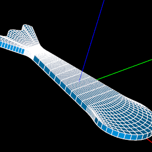

.. include:: links.inc

Using Salome with SfePy
=======================

**NOTE** This tutorial was created in 2014, so it may be obsolete.

Introduction
------------

*Salome* is a powerful open-source tool for generating meshes for
numerical simulation and post processing the results. This is a short
tutorial on using *Salome* as a preprocessor for preparing meshes for
use with *SfePy*.

Tutorial prerequisites
^^^^^^^^^^^^^^^^^^^^^^

This tutorial assumes that you have a working copy of *Salome*. It is
possible to build *Salome* from source code. Fortunately, for the less
brave, many pre-compiled binaries for different platforms are
available at the `Salome download`_ page.  Registration for a free
account may be required to download from the preceding site.

In addition, this tutorial assumes you have a working copy of *SfePy*
with MED read support. See the :doc:`../installation` for help. Note that it
is not actually necessary to "install" *SfePy*; one may run the code
from the source directory (see notation below) after compilation of
the C extension modules (again, see the installation notes if you are
confused).

Note on notation used in this tutorial
^^^^^^^^^^^^^^^^^^^^^^^^^^^^^^^^^^^^^^

We are using the following notations:

- <sfepy_root>: the root directory of the *SfePy* source code
- <work_dir>: the working directory where you plan to save your files

Step 1: Using *Salome*
----------------------

*Salome* has its own set of tutorials and community resources. It is
suggested you look around on `Salome`_ web site to familiarize
yourself with the available resources.

This tutorial follows the EDF Exercise 1 available from the `Salome
Tutorial Site`_. Go ahead and complete this tutorial now. We will use
the result from there in the following.

This is the mesh you should end up with:

Step 2: Exporting mesh from *Salome*
------------------------------------

In the *Salome* MESH module, right click on the mesh object
``Mesh_Partition_Hexa`` you created in the *Salome* EDF Exercise 1
Tutorial and click ``Export to MED file``. Save the file as
``Mesh_Partition_Hexa.med`` in your working directory <work_dir>.

Step 3: Copy *SfePy* project description files
----------------------------------------------

In this tutorial, we will assume that we need to solve a linear
elasticity problem on the mesh generated by *Salome*. Since the
*Salome* mesh looks a bit like a fish, we will try to simulate the
fish waving its tail.

Copy the file
``<sfepy_root>/sfepy/examples/linear_elasticity/linear_elastic.py`` to
<work_dir>. Use your favorite python editor to load this file. We will
customize this file for our purposes.

Step 4: Modify linear_elastic.py
--------------------------------

Mesh specification
^^^^^^^^^^^^^^^^^^

The first thing we have to do is tell *SfePy* to use our new
mesh. Change the line

.. sourcecode:: python

   filename_mesh = data_dir + '/meshes/3d/cylinder.mesh'

to

.. sourcecode:: python

   filename_mesh = 'Mesh_Partition_Hexa.med'

Region specification
^^^^^^^^^^^^^^^^^^^^

Next, we have to define sensible Regions for the mesh. We will apply a
displacement to the Tail and keep the Top and Bottom of the fish
fixed. Change the lines

.. sourcecode:: python

   regions = {
       'Omega' : 'all',
       'Left' : ('vertices in (x < 0.001)', 'facet'),
       'Right' : ('vertices in (x > 0.099)', 'facet'),
       'SomewhereTop' : ('vertices in (z > 0.017) & (x > 0.03) & (x < 0.07)', 'vertex'),
   }

to

.. sourcecode:: python

   regions = {
       'Omega' : 'all',
       'Tail' : ('vertices in (x < -94)', 'facet'),
       'TopFixed' : ('vertices in (z > 9.999) & (x > 54)', 'facet'),
       'BotFixed' : ('vertices in (z < 0.001) & (x > 54)', 'facet'),
   }

Field specification
^^^^^^^^^^^^^^^^^^^

The *Salome* mesh uses hexahedral linear order elements; in *SfePy*
notation these are called ``3_8``, see :doc:`../users_guide`.

Just keep the lines

.. sourcecode:: python

   fields = {
       'displacement': ('real', 'vector', 'Omega', 1),
   }

Boundary condition specifications
^^^^^^^^^^^^^^^^^^^^^^^^^^^^^^^^^

In this section, we tell *SfePy* to fix the top and bottom parts of
the "head" of the fish and move the tail 10 units to the side (z
direction).

Change the lines

.. sourcecode:: python

   ebcs = {
       'Fixed' : ('Left', {'u.all' : 0.0}),
       'Displaced' : ('Right', {'u.0' : 0.01, 'u.[1,2]' : 0.0}),
       'PerturbedSurface' : ('SomewhereTop', {'u.2' : 0.005}),
   }

to

.. sourcecode:: python

   ebcs = {
       'TopFixed' : ('TopFixed', {'u.all' : 0.0}),
       'BotFixed' : ('BotFixed', {'u.all' : 0.0}),
       'Displaced' : ('Tail', {'u.2' : 10, 'u.[0,1]' : 0.0}),
   }

Step 5: Run *SfePy*
-------------------

Save your changes to ``linear_elastic.py``. Now it's time to run the
*SfePy* calculation. In your <work_dir> in your terminal type::

  sfepy-run linear_elastic.py

This will run the *SfePy* calculation. Some progress information is
printed to your screen and the residual (a measure of the convergence
of the solution) is printed for each iteration of the solver. The
solver terminates when this residual is less than a certain value. It
should only take 1 iteration since we are solving a linear
problem. The results will be saved to ``Mesh_Partition_Hexa.vtk``.

Now we can view the results of our work. In your terminal, type::

  sfepy-view Mesh_Partition_Hexa.vtk -f u:wu:f2.0:p0 0:vw:p0

You should get the plot with the deformed and undeformed meshs. Notice how the
fish is bending its tail in response to the applied displacement.

Now you should be able to use meshes created in *Salome* with *SfePy*!
